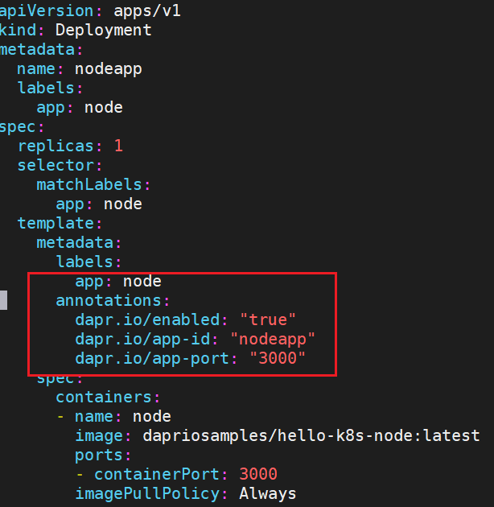

<!-- more -->

## dapr简介

## dapr安装

dapr支持多种运行环境：

1. 在本机上，相当于一个process
2. 在kubernetes中，和业务容器在一个pod里，作为sidecar

我们先尝试在第一种环境里安装dapr。

#### Prerequisites 

Docker installed

#### 安装dapr CLI

```shell
$ wget -q https://raw.githubusercontent.com/dapr/cli/master/install/install.sh -O - | /bin/bash
# verify
$ dapr --version
```

#### 初始化dapr

因为dapr在host上直接运行，相当于需要在host上运行一个process。所以dapr的初始化包括下载dapr二进制包并且安装运行。

```shell
$ dapr init
# 在k8s上运行 dapr init --kubernetes

# verify 
$ docker ps
CONTAINER ID        IMAGE                                 COMMAND                  CREATED             STATUS                 PORTS                                                                                                                                  NAMES
caa1ac7a14c4        openzipkin/zipkin                     "start-zipkin"           2 hours ago         Up 2 hours (healthy)   9410/tcp, 0.0.0.0:9411->9411/tcp                                                                                                       dapr_zipkin
1fa7739631a3        redis                                 "docker-entrypoint.s…"   2 hours ago         Up 2 hours             0.0.0.0:6379->6379/tcp                                                                                                                 dapr_redis
f48ee8e3d872        daprio/dapr                           "./placement"            2 hours ago         Up 2 hours             0.0.0.0:50005->50005/tcp                                                                                                               dapr_placement
```

可以看到有三个容器在运行，Redis容器是做state management和messaging的，Zipkin容器是为了收集traces的。

在`docker init`的时候，同时还创建了一些文件。

```shell
$ ls $HOME/.dapr
bin/  components/  config.yaml
```


### 使用dapr API，run sample

业务代码通过调用dapr API来完成一些业务之外的分布式服务的功能，所以我们可以通过直接调用dapr API来看看dapr API是怎么被使用的。

```shell
$ dapr run --help
# Run a Python application that listens to port 3000:
  dapr run --app-id myapp --app-port 3000 -- python myapp.py
# Run sidecar only:
  dapr run --app-id myapp

Flags:
 # 需要研究这个app-id有啥用？？？
  -a, --app-id string                   The id for your application, used for service discovery
      --app-max-concurrency int         The concurrency level of the application, otherwise is unlimited (default -1)
 # 业务程序监听的端口
  -p, --app-port int                    The port your application is listening on (default -1)
 # dapr和app之间的protocol
  -P, --app-protocol string             The protocol (gRPC or HTTP) Dapr uses to talk to the application (default "http")
      --app-ssl                         Enable https when Dapr invokes the application
  -d, --components-path string          The path for components directory (default "/home/ubuntu/.dapr/components")
 -c, --config string                   Dapr configuration file (default "/home/ubuntu/.dapr/config.yaml")
 # dapr程序监听的端口s
  -G, --dapr-grpc-port int              The gRPC port for Dapr to listen on (default -1)
  -H, --dapr-http-port int              The HTTP port for Dapr to listen on (default -1)
      --enable-profiling                Enable pprof profiling via an HTTP endpoint
  -h, --help                            Print this help message
      --log-level string                The log verbosity. Valid values are: debug, info, warn, error, fatal, or panic (default "info")
  -M, --metrics-port int                The port of metrics on dapr (default -1)
      --placement-host-address string   The host on which the placement service resides (default "localhost")
      --profile-port int                The port for the profile server to listen on (default -1)

```

```shell
# launch a Dapr sidecar that will listen on port 3500 for a blank application named myapp
# 因为没有--config和-d，所以用的就是default的`$HOME/.dapr`下的配置文件。
$ dapr run --app-id myapp --dapr-http-port 3500
```

**调用dapr API去写state，然后读：**

这里是写state，所以url是/v1.0/state/statestore，这个statestore是`$HOME/.dapr/components/statestore.yaml`里面定义的。

```shell
$ curl -X POST -H "Content-Type: application/json" -d '[{ "key": "name", "value": "Bruce Wayne"}]' http://localhost:3500/v1.0/state/statestore
$ curl http://localhost:3500/v1.0/state/statestore/name
"Bruce Wayne"

# 进入redis容器查看在redis中的存储形式
$ docker exec -it dapr_redis redis-cli
127.0.0.1:6379> keys *
1) "myapp||name"   # key使用的是“app的名字||name”
127.0.0.1:6379> hgetall "myapp||name"
1) "data"
2) "\"Bruce Wayne\""
3) "version"
4) "2"
```

### 自己定义component

上述我们用的都是dapr init时生成的简单的config例子。现在我们想自己定义新的component并使用dapr API去调用它（们）？

我们将：

1. 创建一个本地的json的secret store
2. 把这个secret store写在component的定义里，向dapr注册。
3. 通过dapr API获得这个secret store里的内容。

#### 创建本地secret store

创建json文件

```shell
$ cat mysecrets.json
{
     "my-secret" : "I'm Batman"
}
```

```shell
~/.dapr/my-components$ cat localSecretStore.yaml
apiVersion: dapr.io/v1alpha1
kind: Component
metadata:
  name: my-secret-store  # secret store的名字，在api调用时要用到
  namespace: default
spec:
  type: secretstores.local.file  # 指定类型时secretstore，而且是本地文件存储
  version: v1
  metadata:
  - name: secretsFile
    value: /home/ubuntu/.dapr/my-components/mysecrets.json
  - name: nestedSeparator
    value: ":"
```

#### 运行一个dapr的process

```shell
$ dapr run --app-id myapp --dapr-http-port 3500 --components-path ./my-components

# verify 
$ curl localhost:3500/v1.0/secrets/my-secret-store/my-secret
{"my-secret":"I'm Batman"}
```

> 问题：怎么知道一个component时secret还是state还是别的？
>
> 答：通过yaml文件定义component是指定的type，这样在call API时就知道URL怎么写了。（是/v1.0/secrets还是v1.0/state等等）


## 在kubernetes集群上安装dapr

minikube


```shell
$ dapr init -k

$ dapr status -k
  NAME                   NAMESPACE    HEALTHY  STATUS   REPLICAS  VERSION  AGE  CREATED
  dapr-placement-server  dapr-system  True     Running  1         1.0.1    2m   2021-03-09 15:02.06
  dapr-dashboard         dapr-system  True     Running  1         0.6.0    2m   2021-03-09 15:02.05
  dapr-sentry            dapr-system  True     Running  1         1.0.1    2m   2021-03-09 15:02.05
  dapr-sidecar-injector  dapr-system  True     Running  1         1.0.1    2m   2021-03-09 15:02.05
  dapr-operator          dapr-system  True     Running  1         1.0.1    2m   2021-03-09 15:02.05

# 5个dapr的组件
$ k get pods -ndapr-system
NAME                                    READY   STATUS    RESTARTS   AGE
dapr-dashboard-6bb75f9645-8f28z         1/1     Running   0          6m24s
dapr-operator-5f84d9fd4-7smdf           1/1     Running   0          6m24s
dapr-placement-server-0                 1/1     Running   0          6m23s
dapr-sentry-5d67bfbfdc-fzsb6            1/1     Running   0          6m24s
dapr-sidecar-injector-7b556f95d-kpxnc   1/1     Running   0          6m24s


# 注意： placment 没有deployment，只有pod和service。

$ k get deploy -ndapr-system
NAME                    READY   UP-TO-DATE   AVAILABLE   AGE
dapr-dashboard          1/1     1            1           12d
dapr-operator           1/1     1            1           12d
dapr-sentry             1/1     1            1           12d
dapr-sidecar-injector   1/1     1            1           12d

```

### 运行helloworld sample

#### 安装redis作为state store

##### 安装helm

```shell
curl https://baltocdn.com/helm/signing.asc | sudo apt-key add -
sudo apt-get install apt-transport-https --yes
echo "deb https://baltocdn.com/helm/stable/debian/ all main" | sudo tee /etc/apt/sources.list.d/helm-stable-debian.list
sudo apt-get update
sudo apt-get install helm

```

##### 安装redis

```shell
helm repo add bitnami https://charts.bitnami.com/bitnami
helm repo update
helm install redis bitnami/redis

To get your password run:

    export REDIS_PASSWORD=$(kubectl get secret --namespace default redis -o jsonpath="{.data.redis-password}" | base64 --decode)

To connect to your Redis(TM) server:

1. Run a Redis(TM) pod that you can use as a client:
   kubectl run --namespace default redis-client --rm --tty -i --restart='Never' \
    --env REDIS_PASSWORD=$REDIS_PASSWORD \
   --image docker.io/bitnami/redis:6.0.12-debian-10-r3 -- bash

2. Connect using the Redis(TM) CLI:
   redis-cli -h redis-master -a $REDIS_PASSWORD
   redis-cli -h redis-slave -a $REDIS_PASSWORD

To connect to your database from outside the cluster execute the following commands:

    kubectl port-forward --namespace default svc/redis-master 6379:6379 &
    redis-cli -h 127.0.0.1 -p 6379 -a $REDIS_PASSWORD


$ k get pods 
default       redis-headless          ClusterIP   None             <none>        6379/TCP                 96s
default       redis-master            ClusterIP   10.107.253.143   <none>        6379/TCP                 96s
default       redis-slave             ClusterIP   10.102.228.172   <none>        6379/TCP                 96s
$ k get secrets
NAME                          TYPE                                  DATA   AGE
default-token-hnmgm           kubernetes.io/service-account-token   3      155m
redis                         Opaque                                1      3m4s
sh.helm.release.v1.redis.v1   helm.sh/release.v1                    1      3m4s

$ k get svc -owide
NAME             TYPE        CLUSTER-IP       EXTERNAL-IP   PORT(S)    AGE     SELECTOR
kubernetes       ClusterIP   10.96.0.1        <none>        443/TCP    5d13h   <none>
redis-headless   ClusterIP   None             <none>        6379/TCP   5d10h   app=redis,release=redis
redis-master     ClusterIP   10.107.253.143   <none>        6379/TCP   5d10h   app=redis,release=redis,role=master
redis-slave      ClusterIP   10.102.228.172   <none>        6379/TCP   5d10h   app=redis,release=redis,role=slave

$  k get ep
NAME             ENDPOINTS                                          AGE
kubernetes       192.168.49.2:8443                                  5d13h
redis-headless   172.17.0.10:6379,172.17.0.8:6379,172.17.0.9:6379   5d10h
redis-master     172.17.0.9:6379                                    5d10h
redis-slave      172.17.0.10:6379,172.17.0.8:6379                   5d10h
```




minikube user


```shell
$ minikube service nodeapp
|-----------|---------|-------------|---------------------------|
| NAMESPACE |  NAME   | TARGET PORT |            URL            |
|-----------|---------|-------------|---------------------------|
| default   | nodeapp |          80 | http://192.168.49.2:32108 |
|-----------|---------|-------------|---------------------------|
* Opening service default/nodeapp in default browser...
  - http://192.168.49.2:32108
  
# curl localhost:32108不通，因为用的是minikube
$ curl http://192.168.49.2:32108/ports
{"DAPR_HTTP_PORT":"3500","DAPR_GRPC_PORT":"50001"}

export NODE_APP=192.168.49.2:32108

```

Next submit an order to the app

```
curl --request POST --data "{\"data\": { \"orderId\": \"42\" } }" --header "Content-Type:application/json" http://$NODE_APP/neworder
```

Expected output: Empty reply from server

Confirm the order was persisted by requesting it from the app

```
curl http://$NODE_APP/order
```

Expected output:

```da
{"orderId":"42"}
```


dapr cli

dapr host

dapr API

dapr runtime

dapr operator 

dapr sidecar injector

dapr placement service

dapr sentry

building blocks

