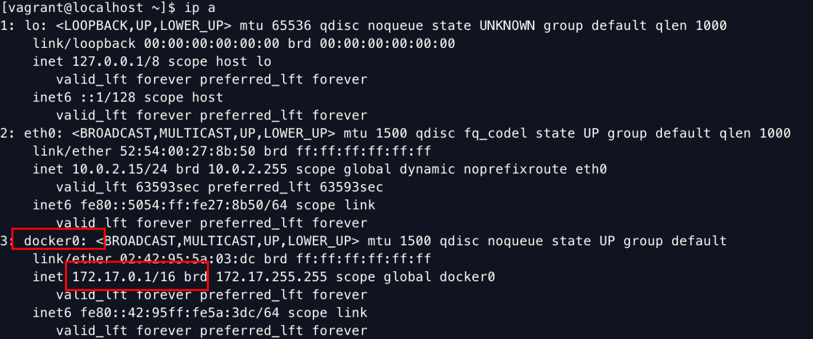
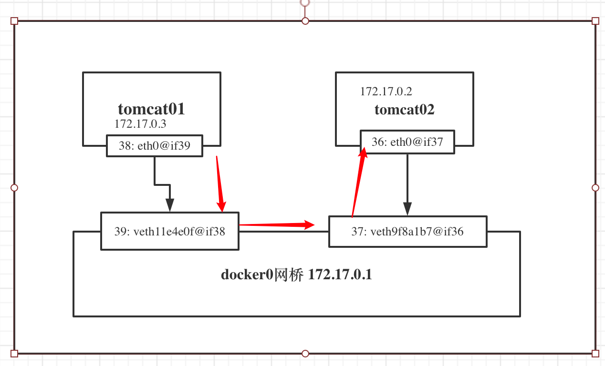
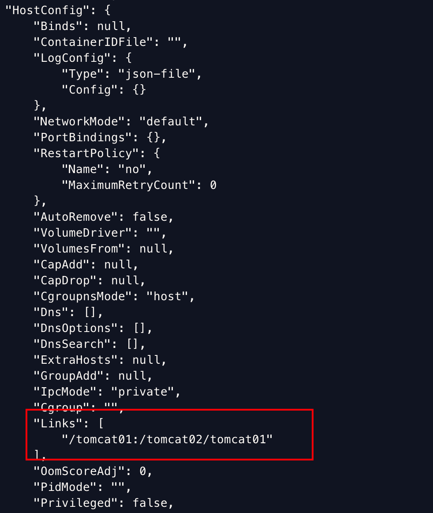
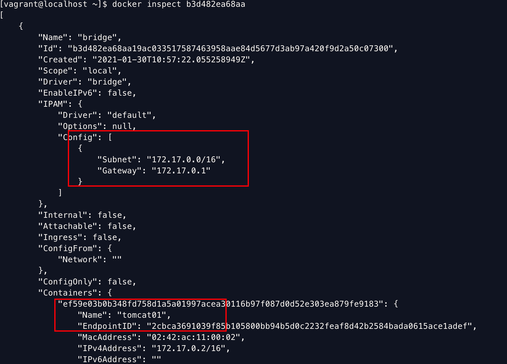
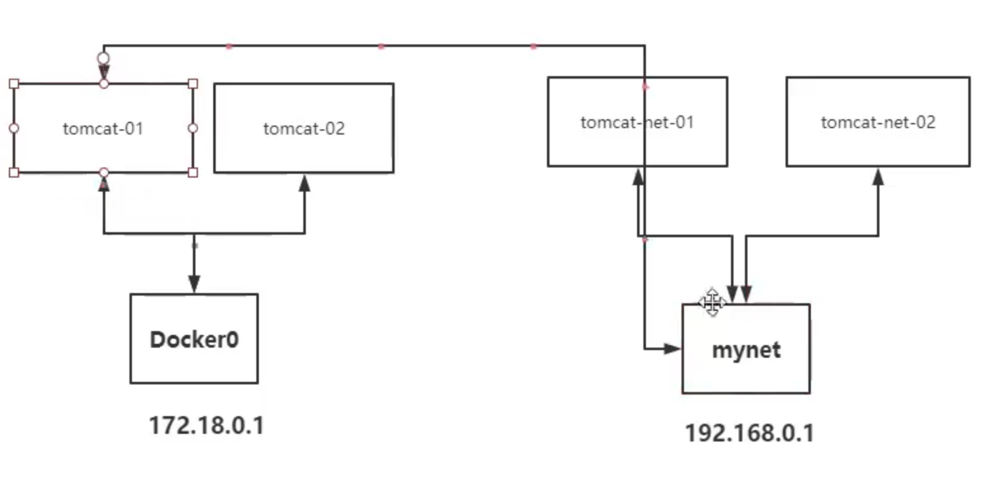

### docker0

先来查看一下host的网络：




```shell
# 启动一个tomcat容器
[vagrant@localhost ~]$ docker run -d -P --name tomcat01 tomcat

# 查看容器里的网络，发现有一个 eth0@if37（172.17.0.2）和host上的docker0（172.17.0.1）在同一个网段。
[vagrant@localhost dockerfile]$ docker exec -it ef59e03b0b34 ip a
1: lo: <LOOPBACK,UP,LOWER_UP> mtu 65536 qdisc noqueue state UNKNOWN group default qlen 1000
    link/loopback 00:00:00:00:00:00 brd 00:00:00:00:00:00
    inet 127.0.0.1/8 scope host lo
       valid_lft forever preferred_lft forever
36: eth0@if37: <BROADCAST,MULTICAST,UP,LOWER_UP> mtu 1500 qdisc noqueue state UP group default
    link/ether 02:42:ac:11:00:02 brd ff:ff:ff:ff:ff:ff link-netnsid 0
    inet 172.17.0.2/16 brd 172.17.255.255 scope global eth0
       valid_lft forever preferred_lft forever
     
# 从host上ping容器的eth0@if37，可以ping通。
[vagrant@localhost dockerfile]$ ping 172.17.0.2
PING 172.17.0.2 (172.17.0.2) 56(84) bytes of data.
64 bytes from 172.17.0.2: icmp_seq=1 ttl=64 time=0.083 ms
64 bytes from 172.17.0.2: icmp_seq=2 ttl=64 time=0.061 ms
```

我们每启动一个docker容器，docker就会给容器分配一个ip，我们只要安装的docker，就会有一个docker0网卡，这个网卡是桥接模式，使用的技术是ve th-pair技术。

启动完tomcat容器后，再在host上查看网络接口，会发现多了一个接口：

```shell
[vagrant@localhost ~]$ ip a
...
# 
37: veth9f8a1b7@if36: <BROADCAST,MULTICAST,UP,LOWER_UP> mtu 1500 qdisc noqueue master docker0 state UP group default
    link/ether 0a:6f:15:99:d0:b8 brd ff:ff:ff:ff:ff:ff link-netnsid 0
    inet6 fe80::86f:15ff:fe99:d0b8/64 scope link
       valid_lft forever preferred_lft forever
```

### veth-pair技术

是一对虚拟设备接口，都是成对出现的。

我们再起一个tomcat，现在有两个容器，tomcat01和tomcat02。看一下他们的网络接口和host的网络。

```shell
$ docker exec -it tomcat01 ip a
1: lo: <LOOPBACK,UP,LOWER_UP> mtu 65536 qdisc noqueue state UNKNOWN group default qlen 1000
    link/loopback 00:00:00:00:00:00 brd 00:00:00:00:00:00
    inet 127.0.0.1/8 scope host lo
       valid_lft forever preferred_lft forever
36: eth0@if37: <BROADCAST,MULTICAST,UP,LOWER_UP> mtu 1500 qdisc noqueue state UP group default
    link/ether 02:42:ac:11:00:02 brd ff:ff:ff:ff:ff:ff link-netnsid 0
    inet 172.17.0.2/16 brd 172.17.255.255 scope global eth0
       valid_lft forever preferred_lft forever
       
$ docker exec -it tomcat02 ip a
1: lo: <LOOPBACK,UP,LOWER_UP> mtu 65536 qdisc noqueue state UNKNOWN group default qlen 1000
    link/loopback 00:00:00:00:00:00 brd 00:00:00:00:00:00
    inet 127.0.0.1/8 scope host lo
       valid_lft forever preferred_lft forever
38: eth0@if39: <BROADCAST,MULTICAST,UP,LOWER_UP> mtu 1500 qdisc noqueue state UP group default
    link/ether 02:42:ac:11:00:03 brd ff:ff:ff:ff:ff:ff link-netnsid 0
    inet 172.17.0.3/16 brd 172.17.255.255 scope global eth0
       valid_lft forever preferred_lft forever
    
$ ip a
...
3: docker0: <BROADCAST,MULTICAST,UP,LOWER_UP> mtu 1500 qdisc noqueue state UP group default
    link/ether 02:42:95:5a:03:dc brd ff:ff:ff:ff:ff:ff
    inet 172.17.0.1/16 brd 172.17.255.255 scope global docker0
       valid_lft forever preferred_lft forever
    inet6 fe80::42:95ff:fe5a:3dc/64 scope link
       valid_lft forever preferred_lft forever
37: veth9f8a1b7@if36: <BROADCAST,MULTICAST,UP,LOWER_UP> mtu 1500 qdisc noqueue master docker0 state UP group default
    link/ether 0a:6f:15:99:d0:b8 brd ff:ff:ff:ff:ff:ff link-netnsid 0
    inet6 fe80::86f:15ff:fe99:d0b8/64 scope link
       valid_lft forever preferred_lft forever
39: veth11e4e0f@if38: <BROADCAST,MULTICAST,UP,LOWER_UP> mtu 1500 qdisc noqueue master docker0 state UP group default
    link/ether ba:3b:43:24:29:92 brd ff:ff:ff:ff:ff:ff link-netnsid 1
    inet6 fe80::b83b:43ff:fe24:2992/64 scope link
       valid_lft forever preferred_lft forever
```

网络模型如下，每个容器在创建的时候会建立一对veth pair，用于和docker0通信，不同容器间的通信也是通过docker0网桥。



### limitation

测试两个容器的连通性

```shell
# ping容器名是ping不通的
vagrant@localhost ~]$ docker exec -it tomcat01 ping tomcat02
ping: tomcat02: No address associated with hostname
# ping ip可以ping通
[vagrant@localhost ~]$ docker exec -it tomcat01 ping 172.17.0.3
PING 172.17.0.3 (172.17.0.3) 56(84) bytes of data.
64 bytes from 172.17.0.3: icmp_seq=1 ttl=64 time=0.058 ms
64 bytes from 172.17.0.3: icmp_seq=2 ttl=64 time=0.066 ms
```

这就是docker0网桥的局限性，**不支持容器名访问**。这里我们可以通过`--link`来实现通过容器名来连通。

#### --link

```shell
# 删除tomcat02，并且重新创建

$ docker run -d -P --name tomcat02 --link tomcat01 tomcat
a9a926b40eb97a28d39ec67418efaa05b362b9917f7375620da18e8f13607282
$ docker exec -it tomcat02 ping tomcat01
PING tomcat01 (172.17.0.2) 56(84) bytes of data.
64 bytes from tomcat01 (172.17.0.2): icmp_seq=1 ttl=64 time=0.090 ms
64 bytes from tomcat01 (172.17.0.2): icmp_seq=2 ttl=64 time=0.060 ms
^C
--- tomcat01 ping statistics ---
2 packets transmitted, 2 received, 0% packet loss, time 11ms
rtt min/avg/max/mdev = 0.060/0.075/0.090/0.015 ms
```

发现可以通过容器名ping通了，但是反向ping还是不通。

```shell
$ docker exec -it tomcat01 ping tomcat02
ping: tomcat02: No address associated with hostname
```

原因是因为我们只是在docker run tomcat02的时候加了`--link`,相当于只对tomcat02设置了针对tomcat01的连通性，反之则没有，所以tomcat01并不知道如何处理tomcat02这个域名。

那么，`--link`  到底在tomcat02里配置了什么呢？ 下面是`docker inspect tomcat02`的输出，可以看到在HostConfig中有一个关于tomcat01的设置。



```shell
# --link主要干了两件事
# 1. 设置tomcat01（被link容器）的环境变量
$ docker exec  -it tomcat02 env | grep -i tomcat01
TOMCAT01_PORT=tcp://172.17.0.2:8080
TOMCAT01_PORT_8080_TCP=tcp://172.17.0.2:8080
TOMCAT01_PORT_8080_TCP_ADDR=172.17.0.2
TOMCAT01_PORT_8080_TCP_PORT=8080
TOMCAT01_PORT_8080_TCP_PROTO=tcp
TOMCAT01_NAME=/tomcat02/tomcat01
TOMCAT01_ENV_LANG=C.UTF-8
TOMCAT01_ENV_JAVA_HOME=/usr/local/openjdk-11
TOMCAT01_ENV_JAVA_VERSION=11.0.9.1
TOMCAT01_ENV_CATALINA_HOME=/usr/local/tomcat
TOMCAT01_ENV_TOMCAT_NATIVE_LIBDIR=/usr/local/tomcat/native-jni-lib
TOMCAT01_ENV_LD_LIBRARY_PATH=/usr/local/tomcat/native-jni-lib
TOMCAT01_ENV_GPG_KEYS=05AB33110949707C93A279E3D3EFE6B686867BA6 07E48665A34DCAFAE522E5E6266191C37C037D42 47309207D818FFD8DCD3F83F1931D684307A10A5 541FBE7D8F78B25E055DDEE13C370389288584E7 61B832AC2F1C5A90F0F9B00A1C506407564C17A3 79F7026C690BAA50B92CD8B66A3AD3F4F22C4FED 9BA44C2621385CB966EBA586F72C284D731FABEE A27677289986DB50844682F8ACB77FC2E86E29AC A9C5DF4D22E99998D9875A5110C01C5A2F6059E7 DCFD35E0BF8CA7344752DE8B6FB21E8933C60243 F3A04C595DB5B6A5F1ECA43E3B7BBB100D811BBE F7DA48BB64BCB84ECBA7EE6935CD23C10D498E23
TOMCAT01_ENV_TOMCAT_MAJOR=9
TOMCAT01_ENV_TOMCAT_VERSION=9.0.41
TOMCAT01_ENV_TOMCAT_SHA512=b6450e590a37c5bccf049b1176c441f0964796995e80d4c7c7d9fb74f9ad817107c303b6b83ed3d71c9251b2b8acf334b90a4abdf9deea122e338643cece0766

# 2. 设置/etc/hosts
$ docker exec  -it tomcat02 cat /etc/hosts
127.0.0.1       localhost
::1     localhost ip6-localhost ip6-loopback
fe00::0 ip6-localnet
ff00::0 ip6-mcastprefix
ff02::1 ip6-allnodes
ff02::2 ip6-allrouters
172.17.0.2      tomcat01 ef59e03b0b34  # 这里设置了tomcat01的IP映射关系
172.17.0.3      a9a926b40eb9
```

### 自定义网络

在docker 安装的时候，有

```shell
$ docker network ls
NETWORK ID     NAME      DRIVER    SCOPE
b3d482ea68aa   bridge    bridge    local  # veth pair - > docker0 桥接模式（缺省模式）
70901896d6a3   host      host      local  # 和host共享网络
51ec536b7953   none      null      local  # 不配置网络，一般不用

# 还有一种container模式，容器内网络连通（不常用）。
```

bridge网络里面配置了gateway， subnet，并且可以看到连接在这个网络上的容器。

这里的gateway就说doker0网桥（172.17.0.1）



#### 创建一个新的网络

```shell
# 默认driver就是bridge
# --driver bridge
# --subnet 192.168.0.0/16 (192.168.0.1- 192.168.255.255)
$ docker network create -d bridge --gateway 192.168.0.1 --subnet 192.168.0.0/16 mynet
49025b4d0eaa1303c112bbec9290a306fac466b9bc56aa81237d823476d86ada
$ docker network ls
NETWORK ID     NAME      DRIVER    SCOPE
b3d482ea68aa   bridge    bridge    local
70901896d6a3   host      host      local
49025b4d0eaa   mynet     bridge    local
51ec536b7953   none      null      local
```

#### 在mynet网络里创建两个新的tomcat
```shell
# 起两个在mynet里的tomcat
[vagrant@localhost ~]$ docker run -d -P --name tomcat-net-01 --net mynet tomcat
8151712ef76b6315018f969b6c0b8116b297a8391793736f7d7825c88a89cc8c
[vagrant@localhost ~]$ docker run -d -P --name tomcat-net-02 --net mynet tomcat
8dada8500e5c3c7993b649984f64c0bb8266a52d6e38256a73807a8e99d901cd

# 发现这两个容器可以通过容器名互通。
# 这就是自定义网络比docker默认的bridge网络（docker0）更高级的地方。
[vagrant@localhost ~]$ docker exec -it tomcat-net-01 ping tomcat-net-02
PING tomcat-net-02 (192.168.0.3) 56(84) bytes of data.
64 bytes from tomcat-net-02.mynet (192.168.0.3): icmp_seq=1 ttl=64 time=0.082 ms
64 bytes from tomcat-net-02.mynet (192.168.0.3): icmp_seq=2 ttl=64 time=0.078 ms
^C
--- tomcat-net-02 ping statistics ---
2 packets transmitted, 2 received, 0% packet loss, time 2ms
rtt min/avg/max/mdev = 0.078/0.080/0.082/0.002 ms
[vagrant@localhost ~]$ docker exec -it tomcat-net-02 ping tomcat-net-01
PING tomcat-net-01 (192.168.0.2) 56(84) bytes of data.
64 bytes from tomcat-net-01.mynet (192.168.0.2): icmp_seq=1 ttl=64 time=0.059 ms
64 bytes from tomcat-net-01.mynet (192.168.0.2): icmp_seq=2 ttl=64 time=0.068 ms

64 bytes from tomcat-net-01.mynet (192.168.0.2): icmp_seq=3 ttl=64 time=0.216 ms
^C
--- tomcat-net-01 ping statistics ---
3 packets transmitted, 3 received, 0% packet loss, time 90ms
rtt min/avg/max/mdev = 0.059/0.114/0.216/0.072 ms
```

#### 不同docker网络里的容器连通（跨网络）

这时又有一个问题。现在我的host上的容器如图所示。



tomcat01和tomcat02是在默认的docker0的网络里，tomcat-net-01和tomcat-net-02在我新创建的mynet里。如果我需要tomcat01和tomcat-net-0连通，应该怎么做呢。

```shell
$ docker network connect mynet tomcat01 
# 把tomcat容器连接到mynet网络中
# 现在就可以ping通了
$ docker exec -it tomcat01 ping tomcat-net-02 
PING tomcat-net-02 (192.168.0.3) 56(84) bytes of data.
64 bytes from tomcat-net-02.mynet (192.168.0.3): icmp_seq=1 ttl=64 time=0.235 ms
64 bytes from tomcat-net-02.mynet (192.168.0.3): icmp_seq=2 ttl=64 time=0.160 ms

# 看一下tomcat01的网卡，发现多了一个eth1@if48，对应IP是 192.168.0.4，在mynet网段中。
$ docker exec -it tomcat01 ip a
1: lo: <LOOPBACK,UP,LOWER_UP> mtu 65536 qdisc noqueue state UNKNOWN group default qlen 1000
    link/loopback 00:00:00:00:00:00 brd 00:00:00:00:00:00
    inet 127.0.0.1/8 scope host lo
       valid_lft forever preferred_lft forever
36: eth0@if37: <BROADCAST,MULTICAST,UP,LOWER_UP> mtu 1500 qdisc noqueue state UP group default
    link/ether 02:42:ac:11:00:02 brd ff:ff:ff:ff:ff:ff link-netnsid 0
    inet 172.17.0.2/16 brd 172.17.255.255 scope global eth0
       valid_lft forever preferred_lft forever
47: eth1@if48: <BROADCAST,MULTICAST,UP,LOWER_UP> mtu 1500 qdisc noqueue state UP group default
    link/ether 02:42:c0:a8:00:04 brd ff:ff:ff:ff:ff:ff link-netnsid 0
    inet 192.168.0.4/16 brd 192.168.255.255 scope global eth1
       valid_lft forever preferred_lft forever
```


### docker的几种网络模式

#### host模式

当我们在容器中执行任何类似ifconfig命令查看网络环境时，看到的都是宿主机上的信息。而外界访问容器中的应用，则直接使用10.10.101.105:80即可，不用任何NAT转换，就如直接跑在宿主机中一样。但是，容器的其他方面，如文件系统、进程列表等还是和宿主机隔离的。

```shell
# 和host一样，共享
$ docker exec -it bb-host ip ad
1: lo: <LOOPBACK,UP,LOWER_UP> mtu 65536 qdisc noqueue qlen 1000
    link/loopback 00:00:00:00:00:00 brd 00:00:00:00:00:00
    inet 127.0.0.1/8 scope host lo
       valid_lft forever preferred_lft forever
    inet6 ::1/128 scope host
       valid_lft forever preferred_lft forever
2: eth0: <BROADCAST,MULTICAST,UP,LOWER_UP> mtu 1500 qdisc fq_codel qlen 1000
    link/ether 52:54:00:27:8b:50 brd ff:ff:ff:ff:ff:ff
    inet 10.0.2.15/24 brd 10.0.2.255 scope global dynamic eth0
       valid_lft 44372sec preferred_lft 44372sec
    inet6 fe80::5054:ff:fe27:8b50/64 scope link
       valid_lft forever preferred_lft forever
3: docker0: <NO-CARRIER,BROADCAST,MULTICAST,UP> mtu 1500 qdisc noqueue
    link/ether 02:42:95:5a:03:dc brd ff:ff:ff:ff:ff:ff
    inet 172.17.0.1/16 brd 172.17.255.255 scope global docker0
       valid_lft forever preferred_lft forever
    inet6 fe80::42:95ff:fe5a:3dc/64 scope link
       valid_lft forever preferred_lft forever
42: br-49025b4d0eaa: <NO-CARRIER,BROADCAST,MULTICAST,UP> mtu 1500 qdisc noqueue
    link/ether 02:42:ad:cf:bc:6f brd ff:ff:ff:ff:ff:ff
    inet 192.168.0.1/16 brd 192.168.255.255 scope global br-49025b4d0eaa
       valid_lft forever preferred_lft forever
    inet6 fe80::42:adff:fecf:bc6f/64 scope link
       valid_lft forever preferred_lft forever
```

#### container模式

这个模式指定新创建的容器和已经存在的一个容器共享一个Network Namespace，而不是和宿主机共享。新创建的容器不会创建自己的网卡，配置自己的IP，而是和一个指定的容器共享IP、端口范围等。同样，两个容器除了网络方面，其他的如文件系统、进程列表等还是隔离的。两个容器的进程可以通过lo网卡设备通信。

#### none模式

这个模式和前两个不同。在这种模式下，Docker容器拥有自己的Network Namespace，但是，并不为Docker容器进行任何网络配置。也就是说，这个Docker容器没有网卡、IP、路由等信息。需要我们自己为Docker容器添加网卡、配置IP等。

#### bridge模式

bridge模式是Docker默认的网络设置，就是docker0的模式。此模式会为每一个容器分配Network Namespace、设置IP等，并将一个主机上的Docker容器连接到一个虚拟网桥上。

### 总结

- Docker0：默认网络，缺点是不能通过容器名访问。

- --link可以解决，但是太麻烦，是单向的。

- 一般需要自定义网络，这个可以通过容器名访问。
- 如果不同网络里的容器需要互联，则需要`docker network connect`，这个命令可以把network1中的容器连接到network2中，此时容器有两个IP，分别对应network1和2。

