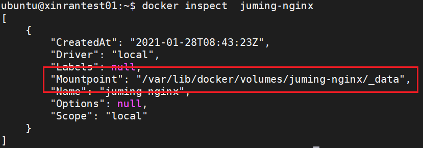
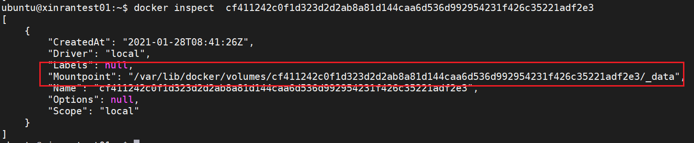
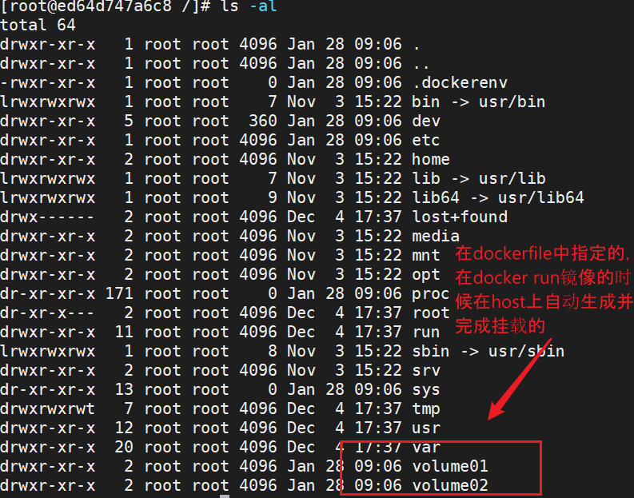
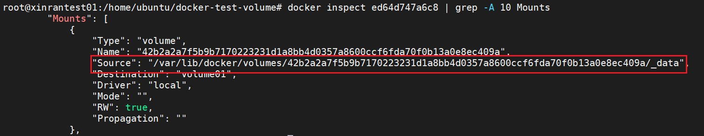
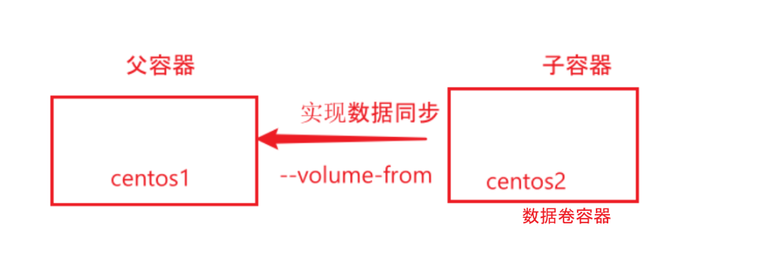
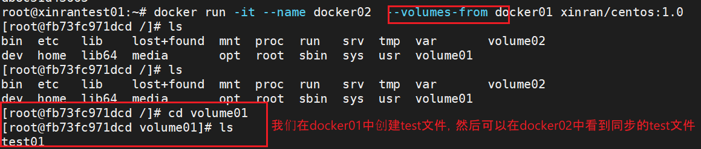

## 容器volume

### 匿名挂载，具名挂载和指定路径挂载

```shell
# 匿名挂载
-v 容器内路径
docker run -d -P --name nginx01 -v /etc/nginx nginx
# 查看node 上的volume
ubuntu@xinrantest01:~$ docker volume ls
DRIVER              VOLUME NAME
local               cf411242c0f1d323d2d2ab8a81d144caa6d536d992954231f426c35221adf2e3
# 可以发现，匿名挂载只写容器里的路径，没有写host上的路径

# 具名挂载
-v host路径：容器内路径 （与-p相似）
ubuntu@xinrantest01:~$ docker run -d -P --name nginx02 -v juming-nginx:/etc/nginx nginx
5f61a3a6d01cd8db3bd99fa1738d0b6cfc74df366dc8ba8b1f4cbe0c97b2cc72
ubuntu@xinrantest01:~$ docker volume ls
DRIVER              VOLUME NAME
local               cf411242c0f1d323d2d2ab8a81d144caa6d536d992954231f426c35221adf2e3
local               juming-nginx
#这里指定了juming-nginx为host上要挂载的目录，这个目录在docker run时被创建

# 查看volume在host上的路径
```





所有docker 容器内的卷，没有指定目录的情况下，都是在`/var/lib/docker/volumes/xxxx/_data`

大多数情况都是使用具名挂载，方便在host上查找volumes

```shell
# 如何确定挂载方式
-v container-path    # 匿名挂载
-v host-path：container-path # 指定路径挂载
-v volume-name（临时起的）：container-path #具名挂载

# 限定容器的权限
docker run -d -P --name nginx02 -v juming-nginx:/etc/nginx:ro   nginx
docker run -d -P --name nginx02 -v juming-nginx:/etc/nginx:rw   nginx

# ro 这个volume只能通过host来操作，container里只有read only的权限
```

### 用DockerFile实现volume

```shell
# create a dockerfile
FROM centos

VOLUME ["volume01","volume02""]

CMD echo "===end==="
CMD /bin/bash

```



可以通过在`var/lib/docker/volumes/`路径下查看对应的目录：




### 数据卷容器

要容器与容器之间同步数据。




```shell
# 启动数据卷容器docker01
docker run -it --name docker01 xinran/centos:1.0
# 启动多个“父容器”docker02，docker03，用--volumes-from指定数据卷容器
docker run -it --name docker02  --volumes-from docker01 xinran/centos:1.0

# 可以指定docker02或者docker01为数据卷容器，这几个容器中volumes都是同步的
docker run -it --name docker03  --volumes-from docker02 xinran/centos:1.0

# 删除docker01，也不会影响docker02，docker03的volume
```




结论：容器之间配置信息的传递，数据卷容器的生命周期一直持续到没有容器使用为止。

但是一旦持久话到了本地，即使删除了所有有这个volume的容器，本地的数据是不会删除的。


