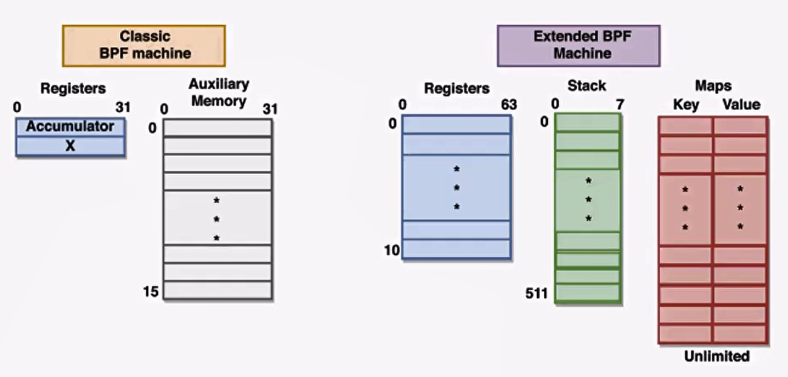

bpf - bakerly profiling filter

最早是抓包用的，最经典的应用：tcpdump就用bpf。

没有bpf之前，抓包要抓nic上所有的包，然后再进行分析

有了bpf之后，可以插入一段小的代码可以指定tcp port，ip等。

ebpf - extension bpf

主要做网络，但远不止网络领域。可以抓system call，linux kernel的function call

kprobe -> fetch kernel

uprobe -> fetch user space

perf events

XDP/AF_XDP

bpf vs ebpf vm - > java vm / webassembly

c  -> 编译成ebpf backend  -> kernel native??

程序方面：

bpf只有两个32bit寄存器，16个32bit内存

ebpf有11个64bit寄存器，512个stack。没有堆的概念，因为在ebpf里面不能new。

maps：user space /kernel space shares data through maps (k-v)。

bpftrace vs bcc vs c program 

