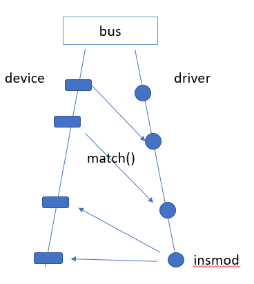

目前流行的几种模式：pass through, sriov(AMD), 半虚拟化（mdev passthrough： Intel gvt-g, Nvidia GRID vGPU), 全虚拟化（VMware： vSGA）

学习路径

pci -》 pci dma -》 iommu -》 passthrough

内存页表 - 》 tlb

cache -》 内存

# PCI

Linux PCI设备驱动实际包括**Linux PCI设备驱动**和**设备本身驱动**两部分。

PCI(Periheral Component Interconnect)有三种地址空间：**PCI I/O空间、PCI内存地址空间和PCI配置空间**。

PCI I/O空间和PCI内存地址空间由设备驱动程序使用

而PCI配置空间由Linux PCI初始化代码使用，用于配置PCI设备，比如中断号以及I/O或内存基地址。

内核：遍历和配置

遍历顺序：从host-pci开始，遇到pci bridge就到下一级pci总线继续遍历，直到遍历完成。（深度优先？）

配置：PCI设备中一般都带有一些RAM和ROM 空间，通常的控制/状态寄存器和数据寄存器也往往以RAM区间的形式出现，而这些区间的地址在设备内部一般都是从0开始编址的，那么当总线上挂接了多个设备时，对这些空间的访问就会产生冲突。所以，这些地址都要先映射到系统总线上，再进一步映射到内核的虚拟地址空间。配置就是通过对PCI配置空间的寄存器进行操作从而完成地址的映射。 device physical address -> system virtual address??

bar寄存器？？

# DMA

https://cloud.tencent.com/developer/article/1194593

dma controller

## I/O Memory Management Unit ( IOMMU )

translates guest physical addresses to host physical add，一般在north bridge里

iommu group  ->  类比cgroup，做设备隔离

一个group对应一个iommu页表。一个group的所有设备的iommu page table是共享的，可以相互修改。

# SRIOV

## VFIO

一种passthrough的方案。

user space： 怎么通过vfio框架来使用设备。

在userspace提供了2个字符文件，用户通过这2个字符文件，通过ioctl来操作设备。

container，group的概念，group对应一个iommu group

操作设备的三种方式：

1. 中断
2. IO
3. DMA

设备角度：怎么通过vfio的框架向上提供设备给user space来用。

首先，设备所在的总线需要支持vfio框架（platform，pci）

例子：对于pci设备来说，需要基于vfio的框架实现一个vfio-pci驱动，然后把设备bind到vfio-pci驱动以供userspace使用。

现在主要支持：platform, pci, mdev设备。

mdev不支持iommu

platform device: 嵌入式系统中的最常见的一种device，没有实际挂载在总线上，需要虚拟一条总线然后挂载在上面。

新的总线框架。

device和driver的匹配关系。

设备总线上有一个设备链表和一个驱动链表。

一个device只能同时对应一个driver，而一个driver可以被多个device绑定。

但是有unused。

## mdev

udev？？？

uio？？

如果一个设备想利用mdev框架，就需要register一个parent deivce(mdev_register_device)

然后这个设备目录如下：

echo UUID > /sysfs/devices/device_paths/mdev_supported_types/type-id/create 就可以创建一个类型是type-id的mediated device。

如：

a是一个pci设备，bind在自己的pci device driver上，如果它支持了mdev，就可以创建多个mdev设备分身，这些mdev设备是绑定在vfio-mdev的driver上的。所以这个设备可以看作即绑定在pci driver上，他的mdev设备又绑定在vfio-mdev driver上。

mdev解决的问题？

对于不支持SRIOV的设备，提供一种方式可以使 用户态（VM）复用这个设备。

物理上不支持VF，但通过mdev可以类似“时分复用”的方式，接近于物理硬件的性能。（但是对于gpu来说，framebuffter这些是不共享复用的)

便于驱动闭源： 因为有些驱动里体现了硬件的设计思路，不方便开源，所以闭源的驱动只需支持mdev的几个API，就可以实现复用。

## Passthrough

**直通模式**的实现依赖于IOMMU的功能。VTD对IOVA的地址转换使得直通设备可以在硬件层次直接使用GPA（Guest Physical Address）地址。GPU直通技术相对于任何其他设备来说，会有额外的PCI 配置空间模拟和MMIO的拦截（参见QEMU VFIO quirk机制）。比如Hypervisor或者Device Module 不会允许虚拟机对GPU硬件关键寄存器的完全的访问权限，一些高权限的操作会被直接拦截。大家或许已经意识到原来直通设备也是有MMIO模拟和拦截的。这对于我们理解GPU 半虚拟化很有帮助。

### libvirt layer

将PCI设备直接分配给guest os时，如果不先从guest中hot-unplug该设备，将无法进行migration。

managed: guest启动时会自动从host上detach， guest shutdown时又重新attach回host。（implict）

unmanged：需要手动从host detach，之后手动re-attach回host。不然libvirt会refuse。（explict）

**直通模式是性能损耗最小的**, Nvidia GPU 直通模式下与物理机的性能对比见下图：（大部分单GPU应用场景的性能对比可以达到96%左右）

## SRIOV

谈起GPU SRIOV那么这个世界上就只有两款产品：S7150和MI25 (AMD)

GPU SRIOV也是一个分时复用的策略。一个简单的调度就是把一个GPU的时间按照特定时间段分片，每个VM拿到特定的时间片。在这些时间片段中，这个VM享用GPU的硬件的全部资源。

不同的GPU虚拟化方案在时间片的切片中会采用不同的方法。有些方案会在一个GPU Context的当前BatchBuffer/CMDBuffer 执行结束之后启动调度，并把GPU交由下一个时间片的所有者。而有些方案则会严格要求在特定时间片结束的时候切换，强行打断当前GPU的执行，并交予下一个时间片的所有者。这种方式确保GPU资源被平均分摊到不同VM。AMD采用第二种。

但是GPU的上下文切换比CPU要慢很多，所以频繁的上下文切换会导致性能下降。

MDEV

GVT-g与Nvidia GRID vGPU并不依赖IOMMU。把会影响性能的访问直接passthrough给虚拟机，把性能无关，功能性的MMIO访问做拦截并在mdev模块内做模拟。

