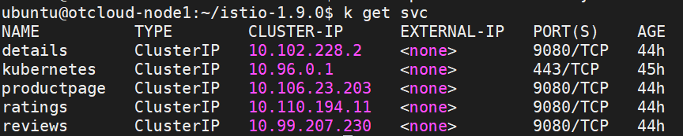
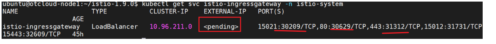
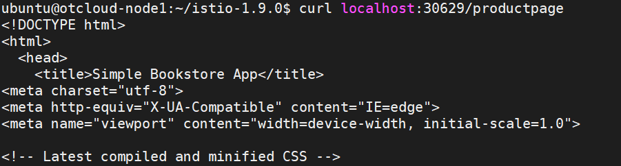
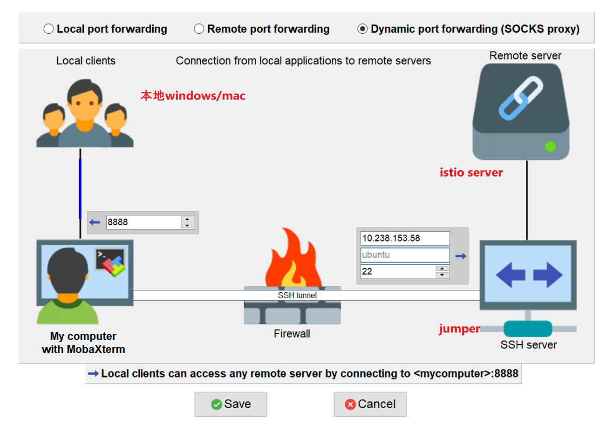
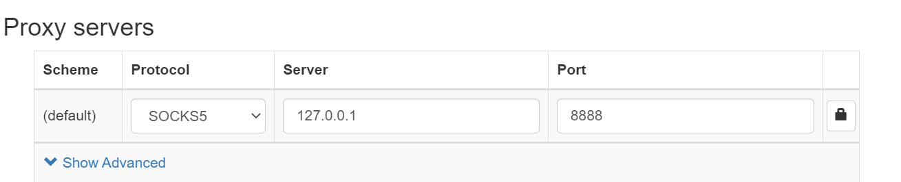
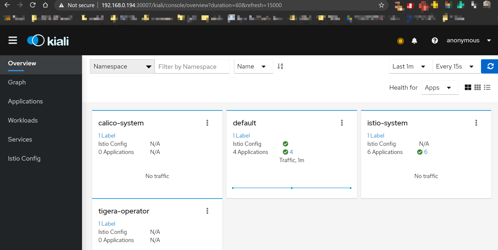

### 环境：

ubuntu20.04

kubernete 1.20


### Deploy K8s(all in one) using Kubeadm

#### Install docker 

```bash
sudo apt-get install docker.io
sudo groupadd docker
sudo usermod -aG docker ${USER}  # To resolve permission errors

# check 
docker ps -a

# docker hub login
docker login
username: xinranwang
password: xxxxxxXf
```

#### Install Kubeadm

```shell
sudo apt-get update && sudo apt-get install -y apt-transport-https curl
curl -s https://packages.cloud.google.com/apt/doc/apt-key.gpg | sudo apt-key add -
cat <<EOF | sudo tee /etc/apt/sources.list.d/kubernetes.list
deb https://apt.kubernetes.io/ kubernetes-xenial main
EOF
sudo apt-get update
sudo apt-get install -y kubelet kubeadm kubectl
sudo apt-mark hold kubelet kubeadm kubectl
```

#### Run kubeadm

```shell
sudo kubeadm init --pod-network-cidr=192.168.0.0/16

mkdir -p $HOME/.kube
sudo cp -i /etc/kubernetes/admin.conf $HOME/.kube/config
sudo chown $(id -u):$(id -g) $HOME/.kube/config
```
#### Install Calico

```shell
kubectl create -f https://docs.projectcalico.org/manifests/tigera-operator.yaml
kubectl create -f https://docs.projectcalico.org/manifests/custom-resources.yaml
watch kubectl get pods -n calico-system

# untaint master node
kubectl taint nodes --all node-role.kubernetes.io/master-

# check
kubectl get nodes -o wide
```

#### Install Istio

```shell
curl -L https://istio.io/downloadIstio | sh -
export PATH="$PATH:/home/ubuntu/istio-1.9.0/bin"
cd istio-1.9.0
istioctl install 

# all pods in "default" ns will have the sidecar
kubectl label namespace default istio-injection=enabled
```

#### Deploy sample

https://istio.io/latest/docs/setup/getting-started/#bookinfo



本机上（集群内），可以通过cluster IP访问：

```shell
$ curl 10.106.23.203:9080
<!DOCTYPE html>
<html>
  <head>
    <title>Simple Bookstore App</title>
<meta charset="utf-8">
<meta http-equiv="X-UA-Compatible" content="IE=edge">
<meta name="viewport" content="width=device-width, initial-scale=1">

<!-- Latest compiled and minified CSS -->
...
```


##### 集群外访问服务

```shell
$ kubectl apply -f samples/bookinfo/networking/bookinfo-gateway.yaml
gateway.networking.istio.io/bookinfo-gateway created
virtualservice.networking.istio.io/bookinfo created

$ istioctl analyze
✔ No validation issues found when analyzing namespace: default.
```



因为我的系统不支持external loadbalancer，所以要通过nodeport的方式暴露host的接口，才可以在本机用`localhost:nodeport`来访问。



#### Install Dashboard

```shell
$ kubectl apply -f samples/addons $ kubectl rollout status deployment/kiali -n istio-system

Waiting for deployment "kiali" rollout to finish: 0 of 1 updated replicas are available... deployment "kiali" successfully rolled out
```

 ```shell
$ istioctl dashboard kiali
# 因为是remote server，需要建立一个tunnel
http://localhost:20001/kiali
Failed to open browser; open http://localhost:20001/kiali in your browser.

 ```

##### 建立tunnel





解释上图：把remote上的所有开放端口，都通过跳板机jumper的22端口转发到本地机器的**8888**端口。在本地的浏览器里设置socks proxy，将本地机器的访问全部转发到**8888**端口，这样就可以完成通过跳板机的端口转发。

##### 问题：

即使按上述设置了，还是访问不到kiali dashboard。追查到原因是：

`~/istio-xxxx/samples/addons/kiali.yaml`

这个文件里声明了kiali service:

```yaml
apiVersion: v1
kind: Service
metadata:
  name: kiali
  namespace: istio-system
  labels:
    helm.sh/chart: kiali-server-1.29.0
    app: kiali
    app.kubernetes.io/name: kiali
    app.kubernetes.io/instance: kiali-server
    version: "v1.29.0"
    app.kubernetes.io/version: "v1.29.0"
    app.kubernetes.io/managed-by: Helm
    app.kubernetes.io/part-of: "kiali"
  annotations:
    kiali.io/api-spec: https://kiali.io/api
    kiali.io/api-type: rest
spec:
  ports:
  - name: http
    protocol: TCP
    port: 20001
    nodePort: 30007   # 增加nodeport
  - name: http-metrics
    protocol: TCP
    port: 9090
    # nodePort: 30008  # 增加nodeport
  selector:
    app.kubernetes.io/name: kiali
    app.kubernetes.io/instance: kiali-server
  type: NodePort # 指定service的类型是nodeport，这样可以从cluster外访问（通过hostip/locahost）
```


可以通过**remote_server_ip:nodeport**访问dashboar。




#### 卸载Uninstall

Remove sample‘s resouces: https://istio.io/latest/docs/examples/bookinfo/#cleanup

Uninstall istio: https://istio.io/latest/docs/setup/getting-started/#uninstall