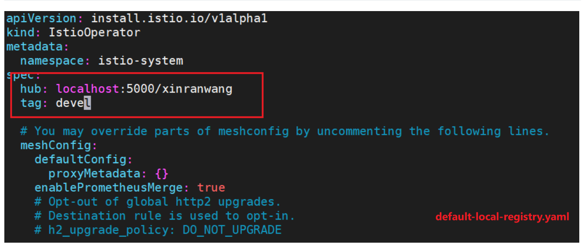
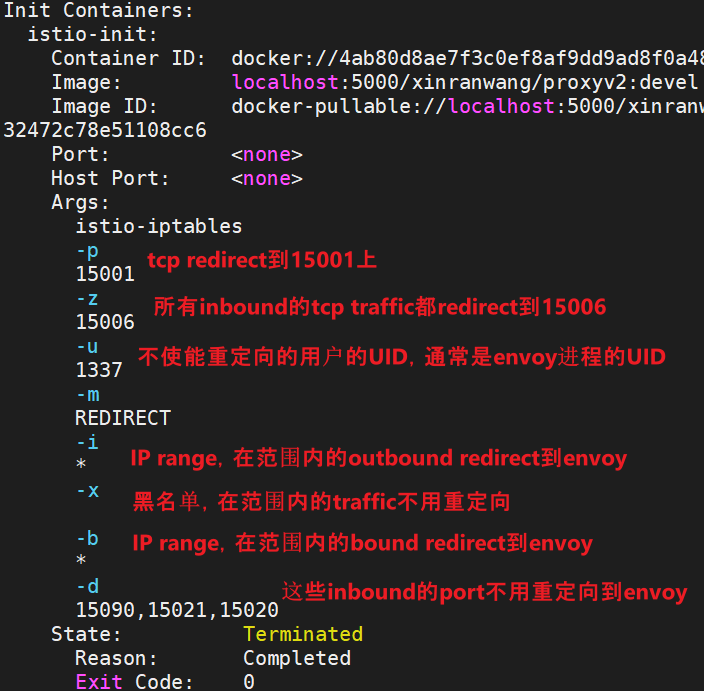

<!-- more -->

之前搭建了istio的生产环境，这次搭建开发环境。

> 参考文档: https://github.com/istio/istio/wiki/Preparing-for-Development

## 建立本地docker registry 

```shell
# 把container的5000端口，映射到localhost:5000
# mounty本地的/mnt/docker_imgs到容器里的/var/lib/registry
# 用官方的registry镜像即可
docker run -d   -p 5000:5000   --restart=always   --name registry   -v /mnt/docker_imgs:/var/lib/registry   registry
```

### 安装Isito开发环境

#### 设置一些环境变量

```shell
# User specific environment and startup programs
# This defines the docker hub to use when running integration tests and building docker images
# eg: HUB="docker.io/istio", HUB="gcr.io/istio-testing"
# 这里的docker registry就是我们上一步设置的本地仓库
export HUB="localhost:5000/xinranwang"

# This defines the docker tag to use when running integration tests and
# building docker images to be your user id. You may also set this variable
# this to any other legitimate docker tag.
export TAG=devel

# This defines a shortcut to change directories to $HOME/istio.io
export ISTIO=$HOME/istio.io

```


```shell
$ mkdir ~/go/src/istio.io/
$ git clone https://github.com/istio/istio.git
$ cd ~/go/src/istio.io/istio
$ make DEBUG=1 build
Unable to find image 'gcr.io/istio-testing/build-tools:master-2021-03-01T22-30-49' locally
master-2021-03-01T22-30-49: Pulling from istio-testing/build-tools
...

# build docker images，with HUB and TAG environment variable.
$ make DEBUG=1 docker

# push images to registry
# 会读取环境变量，就push到本地仓库了
$ make docker.push

# 可以看到本地仓库里有build好的docker image
$ ls /mnt/docker_imgs/docker/registry/v2/repositories/xinranwang/
app                   app_sidecar_debian_10      app_sidecar_ubuntu_focal   istioctl  proxyv2
app_sidecar_centos_7  app_sidecar_debian_9       app_sidecar_ubuntu_xenial  operator
app_sidecar_centos_8  app_sidecar_ubuntu_bionic  install-cni                pilot
```



```shell
ubuntu@otcloud-node1:~/istio-1.9.1/manifests/profiles$ istioctl install -f default-local-registry.yaml
This will install the Istio 1.9.1  profile with ["Istio core" "Istiod" "Ingress gateways"] components into the cluster. Proceed? (y/N) y
✔ Istio core installed
✔ Istiod installed
✔ Ingress gateways installed
✔ Installation complete
```


```shell
k get pods -nistio-system
NAME                                    READY   STATUS    RESTARTS   AGE
istio-ingressgateway-58844f985b-mdckr   1/1     Running   0          34s
istiod-6f846c944f-zwqxf                 1/1     Running   0          38s
```

```shell
kubectl label namespace default istio-injection=enabled
```





```shell
Environment:
------------
ENVOY_PORT=
INBOUND_CAPTURE_PORT=
ISTIO_INBOUND_INTERCEPTION_MODE=
ISTIO_INBOUND_TPROXY_MARK=
ISTIO_INBOUND_TPROXY_ROUTE_TABLE=
ISTIO_INBOUND_PORTS=
ISTIO_OUTBOUND_PORTS=
ISTIO_LOCAL_EXCLUDE_PORTS=
ISTIO_SERVICE_CIDR=
ISTIO_SERVICE_EXCLUDE_CIDR=
ISTIO_META_DNS_CAPTURE=

Variables:
----------
PROXY_PORT=15001
PROXY_INBOUND_CAPTURE_PORT=15006
PROXY_TUNNEL_PORT=15008
PROXY_UID=1337
PROXY_GID=1337
INBOUND_INTERCEPTION_MODE=REDIRECT
INBOUND_TPROXY_MARK=1337
INBOUND_TPROXY_ROUTE_TABLE=133
INBOUND_PORTS_INCLUDE=*
INBOUND_PORTS_EXCLUDE=15090,15021,15020
OUTBOUND_IP_RANGES_INCLUDE=*
OUTBOUND_IP_RANGES_EXCLUDE=
OUTBOUND_PORTS_INCLUDE=
OUTBOUND_PORTS_EXCLUDE=
KUBEVIRT_INTERFACES=
ENABLE_INBOUND_IPV6=false
DNS_CAPTURE=false
DNS_SERVERS=[],[]

Writing following contents to rules file:  /tmp/iptables-rules-1615191401124723984.txt833457753
* nat
-N ISTIO_INBOUND
-N ISTIO_REDIRECT
-N ISTIO_IN_REDIRECT
-N ISTIO_OUTPUT
-A ISTIO_INBOUND -p tcp --dport 15008 -j RETURN
-A ISTIO_REDIRECT -p tcp -j REDIRECT --to-ports 15001
-A ISTIO_IN_REDIRECT -p tcp -j REDIRECT --to-ports 15006
-A PREROUTING -p tcp -j ISTIO_INBOUND
-A ISTIO_INBOUND -p tcp --dport 22 -j RETURN
-A ISTIO_INBOUND -p tcp --dport 15090 -j RETURN
-A ISTIO_INBOUND -p tcp --dport 15021 -j RETURN
-A ISTIO_INBOUND -p tcp --dport 15020 -j RETURN
-A ISTIO_INBOUND -p tcp -j ISTIO_IN_REDIRECT
-A OUTPUT -p tcp -j ISTIO_OUTPUT
-A ISTIO_OUTPUT -o lo -s 127.0.0.6/32 -j RETURN
-A ISTIO_OUTPUT -o lo ! -d 127.0.0.1/32 -m owner --uid-owner 1337 -j ISTIO_IN_REDIRECT
-A ISTIO_OUTPUT -o lo -m owner ! --uid-owner 1337 -j RETURN
-A ISTIO_OUTPUT -m owner --uid-owner 1337 -j RETURN
-A ISTIO_OUTPUT -o lo ! -d 127.0.0.1/32 -m owner --gid-owner 1337 -j ISTIO_IN_REDIRECT
-A ISTIO_OUTPUT -o lo -m owner ! --gid-owner 1337 -j RETURN
-A ISTIO_OUTPUT -m owner --gid-owner 1337 -j RETURN
-A ISTIO_OUTPUT -d 127.0.0.1/32 -j RETURN
-A ISTIO_OUTPUT -j ISTIO_REDIRECT
COMMIT

iptables-restore --noflush /tmp/iptables-rules-1615191401124723984.txt833457753
Writing following contents to rules file:  /tmp/ip6tables-rules-1615191401199424850.txt857904100

ip6tables-restore --noflush /tmp/ip6tables-rules-1615191401199424850.txt857904100
iptables-save 
# Generated by iptables-save v1.6.1 on Mon Mar  8 08:16:41 2021
*nat
:PREROUTING ACCEPT [0:0]
:INPUT ACCEPT [0:0]
:OUTPUT ACCEPT [0:0]
:POSTROUTING ACCEPT [0:0]
:ISTIO_INBOUND - [0:0]
:ISTIO_IN_REDIRECT - [0:0]
:ISTIO_OUTPUT - [0:0]
:ISTIO_REDIRECT - [0:0]
-A PREROUTING -p tcp -j ISTIO_INBOUND
-A OUTPUT -p tcp -j ISTIO_OUTPUT
-A ISTIO_INBOUND -p tcp -m tcp --dport 15008 -j RETURN
-A ISTIO_INBOUND -p tcp -m tcp --dport 22 -j RETURN
-A ISTIO_INBOUND -p tcp -m tcp --dport 15090 -j RETURN
-A ISTIO_INBOUND -p tcp -m tcp --dport 15021 -j RETURN
-A ISTIO_INBOUND -p tcp -m tcp --dport 15020 -j RETURN
-A ISTIO_INBOUND -p tcp -j ISTIO_IN_REDIRECT
-A ISTIO_IN_REDIRECT -p tcp -j REDIRECT --to-ports 15006
-A ISTIO_OUTPUT -s 127.0.0.6/32 -o lo -j RETURN
-A ISTIO_OUTPUT ! -d 127.0.0.1/32 -o lo -m owner --uid-owner 1337 -j ISTIO_IN_REDIRECT
-A ISTIO_OUTPUT -o lo -m owner ! --uid-owner 1337 -j RETURN
-A ISTIO_OUTPUT -m owner --uid-owner 1337 -j RETURN
-A ISTIO_OUTPUT ! -d 127.0.0.1/32 -o lo -m owner --gid-owner 1337 -j ISTIO_IN_REDIRECT
-A ISTIO_OUTPUT -o lo -m owner ! --gid-owner 1337 -j RETURN
-A ISTIO_OUTPUT -m owner --gid-owner 1337 -j RETURN
-A ISTIO_OUTPUT -d 127.0.0.1/32 -j RETURN
-A ISTIO_OUTPUT -j ISTIO_REDIRECT
-A ISTIO_REDIRECT -p tcp -j REDIRECT --to-ports 15001
COMMIT
# Completed on Mon Mar  8 08:16:41 2021
```

