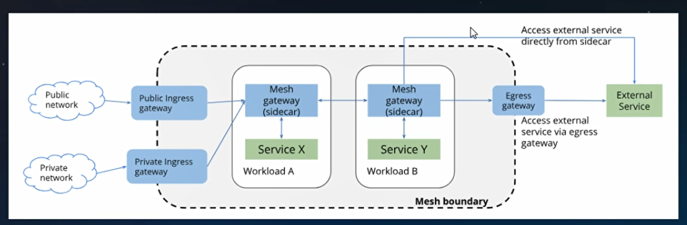
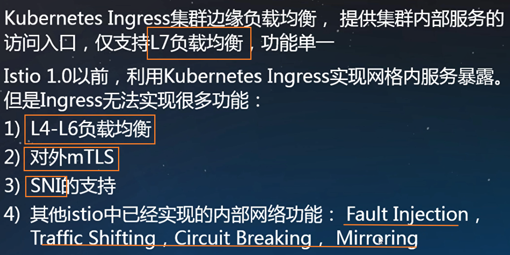

serviceentry：也可以访问外部服务。


## gateway简介

1. L4-L6的负载均衡

2. 提供对外的mtls

在istio网格中，gateway可以部署任意多个，可以共用一个，也可以每个租户，namespace单独隔离。

```yaml
apiVersion: networking.istio.io/v1alpha3
kind: Gateway # istio的一个CRD对象
metadata:
  name: bookinfo-gateway
spec:
  selector:
    istio: ingressgateway # use istio default controller
  servers:
  - port:
      number: 80
      name: http
      protocol: HTTP
    hosts:
    - bookinfo.com       # 允许通过外部访问的域名
```

**VirtualService**定义gateway L7路由，为访问bookinfo.com的http流量，提供路由匹配转发策略。


```yaml
apiVersion: networking.istio.io/v1alpha3
kind: VirtualService
metadata:
  name: bookinfo
spec:
  hosts:
  - bookinfo.com      # 和上面的host字段一样
  gateways:
  - bookinfo-gateway  # 绑定到上面的gateway
  http:
  - match:
    - uri:
        exact: /productpage
    - uri:
        prefix: /static
    - uri:
        exact: /login
    - uri:
        exact: /logout
    - uri:
        prefix: /api/v1/products
    route:
    - destination:   # 如果上述条件之一满足，则去一个叫“productpage”的destinationrule
        host: productpage
        port:
          number: 9080

```

**kubernetes Ingress** vs **Isito gateway**



## gateway原理及实现
```
 pilot-agent
 - args:
    - proxy
    - router
    - --domain
    - $(POD_NAMESPACE).svc.cluster.local
    - --proxyLogLevel=warning
    - --proxyComponentLogLevel=misc:error
    - --log_output_level=default:info
    - --serviceCluster
    - istio-ingressgateway
```