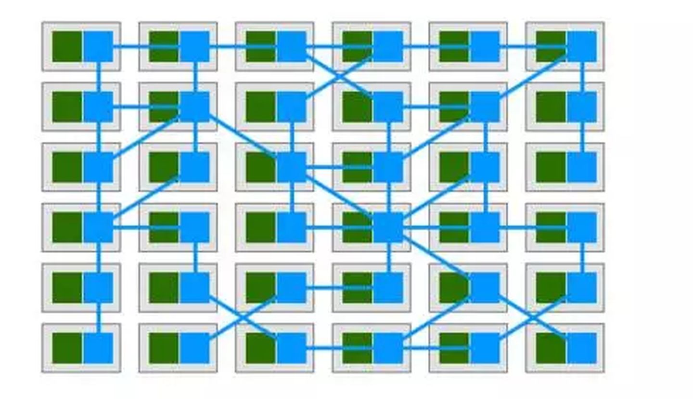
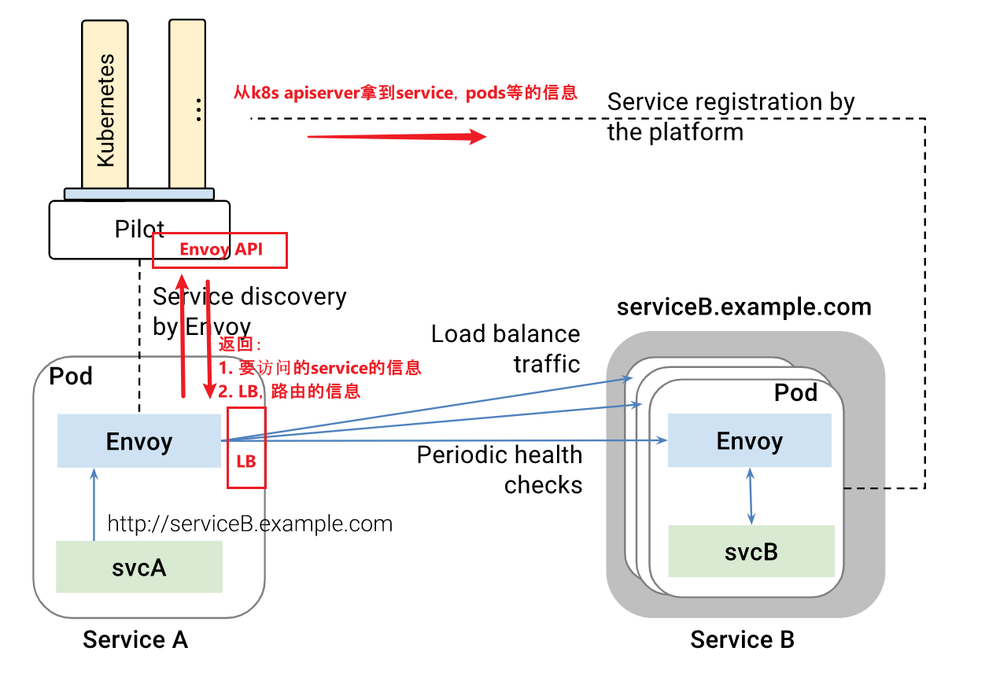
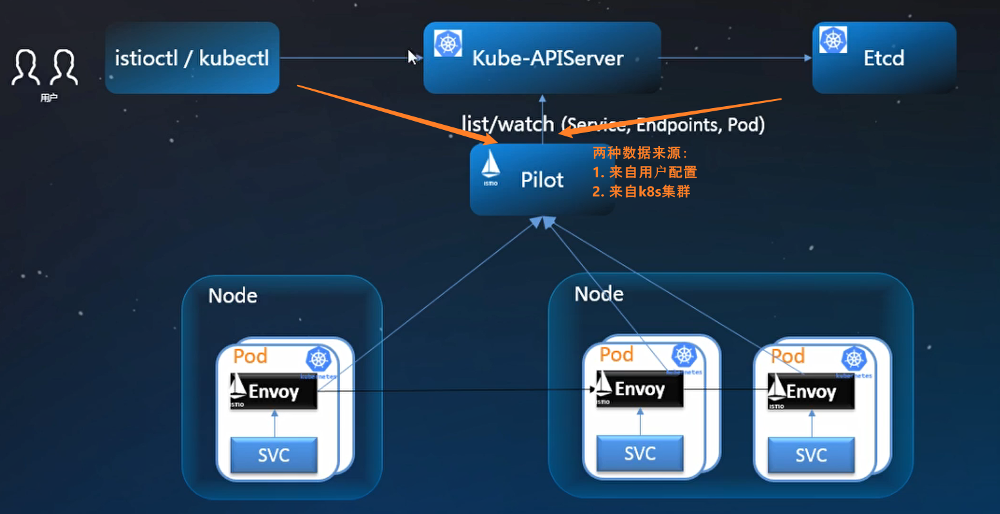
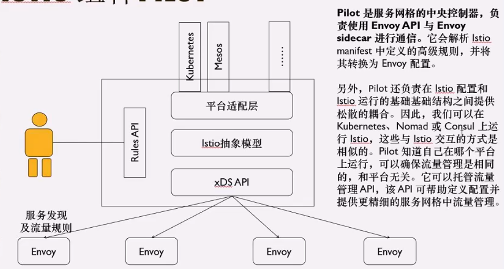

## service mesh（服务网格）

Service Mesh通过一个个"代理" 来为微服务转发/接收所有流量，通过控制这些代理，就可以实现服务连接，注册，发现，负载均衡，熔断，监控等等一系列服务治理相关功能，从而微服务的代码不再需要服务治理的实现，换句话说，也就是服务治理对于微服务开发者而言是透明的。如下图所示：绿色方块为微服务，蓝色方块为 service mesh 的代理，蓝色线条为服务间通讯。可以看到蓝色的方块和线条组成了整个网格。这个网络就是 Service Mesh。

## Istio

Go编写，控制面。对应的数据面是通常是envoy（基于C++）

### 架构图

### 基本组件

#### envoy

以sidecar的形式运行在服务所在的pod中，所有service的流量进出都必须通过envoy proxy，用来控制service之间的访问，service是感知不到envoy proxy的存在。

envoy可以和控制平面（istio的组件）双向交互，可以从istio拿到一些策略和服务发现的信息，同时也可以给istio传回一些监控的数据等等。

#### Istiod

Istiod提供服务发现, 服务配置和证书管理。

stiod acts as a Certificate Authority (CA) and generates certificates to allow secure mTLS communication in the data plane.

## Istio的服务发现流程

istio的pilot组件时负责服务发现的。在pilot里只有服务发现的定义，但是没有服务发现的实现，服务发现的实现是在pilot adapter对接的platform（比如k8s）里的。pilot adapter可以对接不同的平台，比如cloudfoudary，eurake，kubernetes，consul等等，但是k8s的适配最好，也是istio社区的重点。

### isito和kubernetes服务概念对应关系

|  isito   | kubernetes |
| :------: | :--------: |
| service  |  service   |
| instance |  endpoint  |
| version  | deployment |

每个envoy里都有全量的规则。（现在也是吗？？）

Envoy （C++），CNCF毕业（kubernets，Prometheus之后）。

xDS：

listener（LDS）：

routes（RDS）：

cluster（CDS）：

endpoint（EDS）：

Envoy目前支持的三种LB：

1. 轮询round robin
2. 随机random
3. 加权weighted least request.

Istio：

用户可以配置（通过rules API）的CRD：

gateway：

virtualservice：

destinationrule：

serviceEntry：

### Pilot

1. 平台适配层: 将不同的平台资源和istio的抽象模型相互转换。
2. xds API： envoy API

### citadel：

没有citadel的时候，就是end to end的非对称密钥交换，然后对称加密传输数据。

citadel：就是存储证书，发放证书的一个东西。

### Galley

istio自身创建的CRD有50多种，可以理解成验证，解析，管理CRD的东西。

### Mixer

1.7之后弃用，下放到envoy里。telemetry v2是在istio里？

### 其他解决方案

sofamesh蚂蚁金服，用**mosn**替换envoy，golang，合并mixer，增强pilot，增加对sofa rpc， dubbo的支持。

linkerd =  control plane + data plane

linkerd v1可以脱离k8s

linkerd v2和k8s紧耦合

consul

192.168.0.195 zhang

192.168.0.196 ci

192.168.0.199 zhang