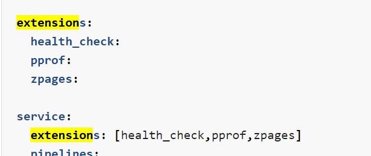

## Serverless

function as a service

backend as a service

stateless

short lived

api gateway trigger/event trigger -> event driven

auto scaled /scaled to zero

reduced cost

stateless: 没有任何session的信息，每次执行都是一样的结果，没有前后依赖关系。


## Knative

k8s-based

0-1启动

event-driven

source code - > run container

### Serving

runtime组件，管理，运行serverless的container

take care of networking, autoscaling and revision(version) tracking


CRDs

```shell
Certificate
Configuration
Ingress
Metric
PodAutoscaler
Revision
Route
ServerlessService
Service
Image
```

autoscaler

activator

queue-proxy sidecar 检测该revision上观察到的并发量，每隔一秒将此数据发送到autoscaler上，autoscaler每个两面对这些指标进行评估，基于结果层架或者奸杀revision部署的规模。


### Eventing

事件的定义，订阅和触发


### Networking

Ingress

TLS


### Building（tekton）

gitub source code build into container image


opentelemetry


