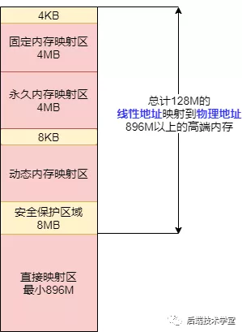
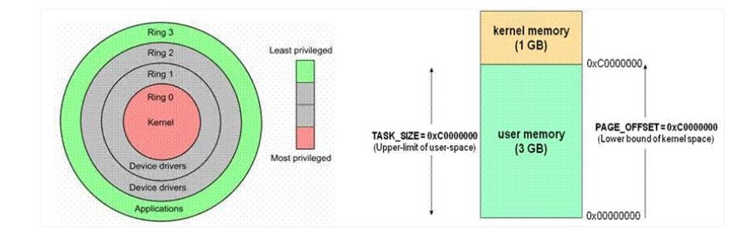

为了充分利用和管理系统内存资源，Linux采用虚拟内存管理技术，利用虚拟内存技术让每个进程都有`4GB` 互不干涉的虚拟地址空间。

进程初始化分配和操作的都是基于这个「虚拟地址」，只有当进程需要实际访问内存资源的时候才会建立**虚拟地址和物理地址的映射**，调入物理内存页。

- 避免用户直接访问物理内存地址，防止一些破坏性操作，保护操作系统
- 每个进程都被分配了4GB的虚拟内存，用户程序可使用比实际物理内存更大的地址空间

当需进程要实际访问内存的时候，会由内核的「请求分页机制」产生「缺页异常」调入物理内存页。

把虚拟地址转换成内存的物理地址，这中间涉及利用`MMU` 内存管理单元（Memory Management Unit ) 对虚拟地址分段和分页（段页式）地址转换

`Linux` 内核会将物理内存分为3个管理区，分别是：

### ZONE_DMA

`DMA`内存区域。包含0MB~16MB之间的内存页框，可以由老式基于`ISA`的设备通过`DMA`使用，直接映射到内核的地址空间。

### ZONE_NORMAL

普通内存区域。包含16MB~896MB之间的内存页框，常规页框，直接映射到内核的地址空间。

### ZONE_HIGHMEM

高端内存区域。包含896MB以上的内存页框，不进行直接映射，可以通过永久映射和临时映射进行这部分内存页框的访问。

## 用户空间地址

用户进程能访问的是「用户空间」，每个进程都有自己独立的用户空间，虚拟地址范围从从 `0x00000000` 至 `0xBFFFFFFF` 总容量3G 。

进程（执行的程序）占用的用户空间按照「 访问属性一致的地址空间存放在一起 」的原则，划分成 `5`个不同的内存区域。访问属性指的是“可读、可写、可执行等 。

- 代码段

  代码段是用来存放可执行文件的操作指令，可执行程序在内存中的镜像。代码段需要防止在运行时被非法修改，所以只准许读取操作，它是不可写的。

- 数据段

  数据段用来存放可执行文件中已初始化全局变量，换句话说就是存放程序静态分配的变量和全局变量。

- BSS段

  `BSS`段包含了程序中未初始化的全局变量，在内存中 `bss` 段全部置零。

- 堆 `heap`

  堆是用于存放进程运行中被动态分配的内存段，它的大小并不固定，可动态扩张或缩减。当进程调用malloc等函数分配内存时，新分配的内存就被动态添加到堆上（堆被扩张）；当利用free等函数释放内存时，被释放的内存从堆中被剔除（堆被缩减）

- 栈 `stack`

  栈是用户存放程序临时创建的局部变量，也就是函数中定义的变量（但不包括 `static` 声明的变量，static意味着在数据段中存放变量）。除此以外，在函数被调用时，其参数也会被压入发起调用的进程栈中，并且待到调用结束后，函数的返回值也会被存放回栈中。由于栈的先进先出特点，所以栈特别方便用来保存/恢复调用现场。从这个意义上讲，我们可以把堆栈看成一个寄存、交换临时数据的内存区。

## 内核空间

在 `x86 32` 位系统里，Linux 内核地址空间是指虚拟地址从 `0xC0000000` 开始到 `0xFFFFFFFF` 为止的高端内存地址空间，总计 `1G` 的容量， 包括了内核镜像、物理页面表、驱动程序等运行在内核空间 。

用 `virt_to_phys()`函数将内核虚拟空间中的线性地址转化为物理地址。

用户态切换到内核态的 3 种方式：系统调用、异常、外设中断

用户态的程序就不能随意操作内核地址空间，具有一定的安全保护作用；内核态线程共享内核地址空间；

MMU

- MMU 是一种硬件电路，它包含两个部件，一个是分段部件，一个是分页部件
- 分段机制把一个逻辑地址转换为线性地址
- 分页机制把一个线性地址转换为物理地址

