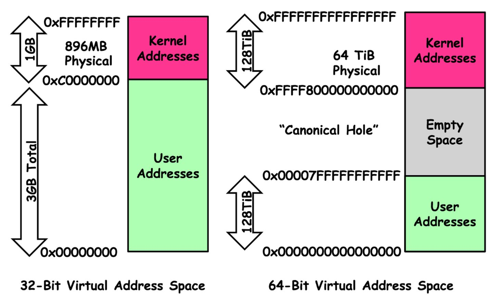
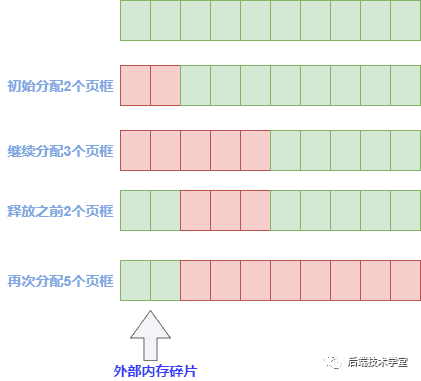

<!-- more -->

# 主流存储设备

.svg)


# 物理内存

我们不讨论cache，flash，rom这些，只讨论memory也就是通常所说的主存，现在一般是DDR4.


内存工作频率 = min(cpu外部频率，主板频率，内存自身频率)

对于一个32位系统来说，地址总线最多是32bit，它能寻址的最大范围是2^32=4GB，所以也就能插4GB的内存条，插8GB的也没有用。

64位CPU出现之后，其地址总线位宽一般采用的是36位或者40位，它们寻址的物理地址空间为64GB或者1T（intel）。

> 注意： 常说的**CPU位宽**指的是**数据总线**位宽，最大寻址范围和CPU位宽无关。


查询系统地址总线位宽：

```shell
cat /proc/cpuinfo  | grep address
address sizes   : 46 bits physical, 48 bits virtual
# 物理内存寻址范围/虚拟内存寻址范围可以不同
```

## 物理内存3个管理区

`Linux` 内核会将物理内存分为3个管理区，分别是：

### ZONE_DMA

`DMA`内存区域。包含0MB~16MB之间的内存页框，可以由老式基于`ISA`的设备通过`DMA`使用，直接映射到内核的地址空间。

### ZONE_NORMAL

普通内存区域。包含16MB~896MB之间的内存页框，常规页框，直接映射到内核的地址空间。

### ZONE_HIGHMEM

高端内存区域。包含896MB以上的内存页框，不进行直接映射，可以通过永久映射和临时映射进行这部分内存页框的访问。


# 虚拟内存

对于32位系统来说，为了充分利用和管理系统内存资源，Linux采用虚拟内存管理技术，利用虚拟内存技术让每个进程都有`4GB` 互不干涉的虚拟地址空间。

为什么是4GB? 

之所以是 4GB ，是因为在 32 位的操作系统中，一个指针长度是 4 字节 （32位）， 2的32次 方个地址寻址能力是从 0x00000000~0xFFFFFFFF 即为 4GB 大小的容量。

进程初始化分配和操作的都是基于这个「虚拟地址」，只有当进程需要实际访问内存资源的时候才会建立**虚拟地址和物理地址的映射**，调入物理内存页。


这么做的目的是：

- 避免用户直接访问物理内存地址，防止一些破坏性操作，保护操作系统
- 每个进程都被分配了4GB的虚拟内存，用户程序可使用比实际物理内存更大的地址空间

当需进程要实际访问内存的时候，会由内核的「请求分页机制」产生「缺页异常」调入物理内存页。


**64位系统对比：**



## 用户态和内核态

用户态切换到内核态的 3 种方式：系统调用、异常、外设中断

用户态的程序就不能随意操作内核地址空间，具有一定的安全保护作用；内核态线程共享内核地址空间；


## 用户空间虚拟内存 - 3GB

用户进程能访问的是「用户空间」，每个进程都有自己独立的用户空间，虚拟地址范围从从 `0x00000000` 至 `0xBFFFFFFF` 总容量3G 。

进程（执行的程序）占用的用户空间按照「 访问属性一致的地址空间存放在一起 」的原则，划分成 `5`个不同的内存区域。访问属性指的是“可读、可写、可执行等 。


- 代码段

  代码段是用来存放可执行文件的操作指令，可执行程序在内存中的镜像。代码段需要防止在运行时被非法修改，所以**只准许读取操作，它是不可写的**。

- 数据段

  数据段用来存放可执行文件中**已初始化全局变量**，换句话说就是存放程序静态分配的变量和全局变量。

- BSS段

  `BSS`段包含了程序中**未初始化的全局变量**，在内存中 `bss` 段全部置零。

- 堆 `heap`

  堆是用于存放进程运行中被**动态分配的内存段**，它的大小并不固定，可动态扩张或缩减。当进程调用malloc等函数分配内存时，新分配的内存就被动态添加到堆上（堆被扩张）；当利用free等函数释放内存时，被释放的内存从堆中被剔除（堆被缩减）

- 栈 `stack`

  栈是用户存放程序**临时创建的局部变量**，也就是函数中定义的变量（但不包括 `static` 声明的变量，static意味着在数据段中存放变量）。除此以外，在函数被调用时，其参数也会被压入发起调用的进程栈中，并且待到调用结束后，函数的返回值也会被存放回栈中。由于栈的先进先出特点，所以栈特别方便用来保存/恢复调用现场。从这个意义上讲，我们可以把堆栈看成一个寄存、交换临时数据的内存区。

## 内核空间虚拟内存 - 1GB

在 `x86 32` 位系统里，Linux 内核地址空间是指虚拟地址从 `0xC0000000` 开始到 `0xFFFFFFFF` 为止的高端内存地址空间，总计 `1G` 的容量， 包括了内核镜像、物理页面表、驱动程序等运行在内核空间 。虚拟空间的1GB怎么对应到物理内存的4GB甚至更多（取决于地址总线最大寻址和插的内存条大小）呢？


- 直接映射区：线性空间中从 3G 开始到3GB+896M 的区间，直接映射到物理内存的 0 - 896MB（dma zone + normal zone），物理和虚拟中间差一个固定的偏移量：PAGE_OFFSET = 0xC0000000。

  虚拟地址 = `PAGE_OFFSET` + 物理地址，也可以用 `virt_to_phys()`函数将内核虚拟空间中的线性地址转化为物理地址。

- 除了直接映射区：还有4G-(3G+896MB) = 128MB的空间要映射到物理内存的其他空间，显然1：1map是不够的。所以内核空间拿出了最后的 128M 地址区间，划分成下面三个高端内存映射区（动态分配，可以重复映射不同的地址）：

  - 动态内存映射区：该区域由内核函数 vmalloc 来分配，特点是：线性空间连续，但是对应的物理地址空间不一定连续。`vmalloc` 分配的线性地址所对应的物理页可能处于低端内存，也可能处于高端内存。
  - 永久内存映射区：该区域可访问高端内存（highmem），访问方法是使用 `alloc_page (_GFP_HIGHMEM)` 分配高端内存页或者使用`kmap`函数将分配到的高端内存映射到该区域。
  - 固定映射区：该区域和 4G 的顶端只有 4k 的隔离带，其每个地址项都服务于特定的用途，如：ACPI_BASE 等


## 虚拟地址 -  物理地址的映射关系图


# MMU

把虚拟地址转换成内存的物理地址，这中间涉及利用`MMU` 内存管理单元（Memory Management Unit ) 对虚拟地址分段和分页（段页式）地址转换。

- MMU 是一种硬件电路，它包含两个部件，一个是分段部件，一个是分页部件
- 分段机制把一个逻辑地址转换为线性地址
- 分页机制把一个线性地址转换为物理地址

> 单片机是没有mmu的，程序直接访问物理地址。


## 分段机制

## 分页机制

页表保存在**物理内存中**，**MMU会查找页表来确定一个VA应该映射到什么PA。**

**段错误**我们已经遇到过很多次了，它是这样产生的：

1. 用户程序要访问的一个VA，经MMU检查无权访问。
2. MMU产生一个异常，CPU从用户模式切换到特权模式，跳转到内核代码中执行异常服务程序。
3. 内核把这个异常解释为段错误，把引发异常的进程终止掉。

page -  4KB

struct-page 

4G内存一共有4GB/4KB = 2 ^20个 

## 物理内存分配

### 外部碎片

当需要分配大块内存的时候，要用好几页组合起来才够，而系统分配物理内存页的时候会尽量分配连续的内存页面，频繁的分配与回收物理页导致大量的小块内存夹杂在已分配页面中间，形成外部碎片，举个例子：



### 内部碎片

物理内存是按页来分配的，这样当实际只需要很小内存的时候，也会分配至少是 4K 大小的页面，而内核中有很多需要以字节为单位分配内存的场景，这样本来只想要几个字节而已却不得不分配一页内存，除去用掉的字节剩下的就形成了内部碎片。


### Buddy（伙伴）分配算法 -> 外部碎片

相同大小的页框块用链表串起来，页框块就像手拉手的好伙伴，也是这个算法名字的由来。

### slab分配器 - > 内部碎片

通过将内存按使用对象不同**再划分**成不同大小的空间，应用于内核对象的缓存。

# NUMA

Node，Zone，Page


```shell
cat /proc/zoneinfo | grep Node
Node 0, zone      DMA
Node 0, zone    DMA32 # 64 bit system
Node 0, zone   Normal
Node 0, zone  Movable # 防止内存碎片化的ZONE_MOVABLE
Node 0, zone   Device # 支持设备热插拔的ZONE_DEVICE
Node 1, zone      DMA
Node 1, zone    DMA32
Node 1, zone   Normal
Node 1, zone  Movable
Node 1, zone   Device
# 没有 zone highmem， 因为是64位系统，可以直接映射
```


```shell
$ lscpu
Architecture:                    x86_64
CPU op-mode(s):                  32-bit, 64-bit
Byte Order:                      Little Endian
Address sizes:                   46 bits physical, 48 bits virtual
CPU(s):                          32  # cores per socket * sockets * thread per core 
On-line CPU(s) list:             0-31
Thread(s) per core:              2
Core(s) per socket:              8
Socket(s):                       2
NUMA node(s):                    2
Vendor ID:                       GenuineIntel
CPU family:                      6
Model:                           45
Model name:                      Intel(R) Xeon(R) CPU E5-2670 0 @ 2.60GHz
Stepping:                        7
CPU MHz:                         1207.495
CPU max MHz:                     3300.0000
CPU min MHz:                     1200.0000
BogoMIPS:                        5187.02
Virtualization:                  VT-x
L1d cache:                       512 KiB  # instruction cache
L1i cache:                       512 KiB  # data cache
L2 cache:                        4 MiB
L3 cache:                        40 MiB
NUMA node0 CPU(s):               0-7,16-23
NUMA node1 CPU(s):               8-15,24-31
Vulnerability Itlb multihit:     KVM: Mitigation: Split huge pages
Vulnerability L1tf:              Mitigation; PTE Inversion; VMX conditional cache flushes, SMT vulnerable
Vulnerability Mds:               Mitigation; Clear CPU buffers; SMT vulnerable
Vulnerability Meltdown:          Mitigation; PTI
Vulnerability Spec store bypass: Mitigation; Speculative Store Bypass disabled via prctl and seccomp
Vulnerability Spectre v1:        Mitigation; usercopy/swapgs barriers and __user pointer sanitization
Vulnerability Spectre v2:        Mitigation; Full generic retpoline, IBPB conditional, IBRS_FW, STIBP conditional, RSB filling
Vulnerability Srbds:             Not affected
Vulnerability Tsx async abort:   Not affected
Flags:                           fpu vme de pse tsc msr pae mce cx8 apic sep mtrr pge mca cmov pat pse36 clflush dts acpi mmx fxs
                                 r sse sse2 ss ht tm pbe syscall nx pdpe1gb rdtscp lm constant_tsc arch_perfmon pebs bts rep_good
                                  nopl xtopology nonstop_tsc cpuid aperfmperf pni pclmulqdq dtes64 monitor ds_cpl vmx smx est tm2
                                  ssse3 cx16 xtpr pdcm pcid dca sse4_1 sse4_2 x2apic popcnt tsc_deadline_timer aes xsave avx lahf
                                 _lm epb pti ssbd ibrs ibpb stib

```


### 