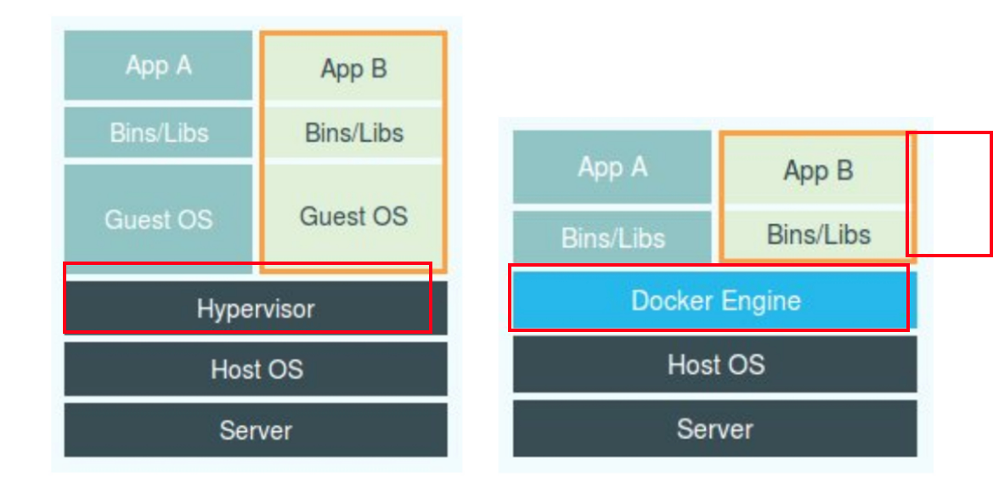

## namespace

#### PID namespace

一个容器就是是一个进程，在启动下面的容器的时候：

```shell
$ docker run -it busybox sh  # sh是容器的第一个进程
/ # ps
PID   USER     TIME  COMMAND
    1 root      0:00 sh #PID=1
    7 root      0:00 ps #PID=7
```

Linux在创建新进程的时候，它的系统调用是

```c
int pid = clone(main_function, stack_size, SIGCHLD, NULL); 
```

我们可以在系统调用的时候，传入一个`CLONE_NEWPID`参数。这样这个进程就是在一个全新的namespace里，塔是1号进程。上述的`docker run`命令的底层，实则也是调用了：

```c
int pid = clone(main_function, stack_size, CLONE_NEWPID | SIGCHLD, NULL); 
```

这只是Linux提供的namespace的一种，叫做PID namespace。

在新的命名空间里创建的进程，在命名空间里的PID=1，但是在host上查看，PID就不等于1了。

```shell
$ ps -aux | grep sh
root       36046  0.0  0.0   1324     4 pts/0    Ss+  01:15   0:00 sh  # PID=36046
```

此外，Linux 操作系统还提供了 **Mount**、**UTS**、**IPC**、**Network** 和 **User** 这些 Namespace，用来对各种不同的进程上下文进行“障眼法”操作。

#### Mount namespace

用于让被隔离进程只看到当前 Namespace 里的挂载点信息

#### Network Namespace

用于让被隔离进程看到当前 Namespace 里的网络设备和配置。


## 虚拟机 vs 容器

#### hypervisor和docker engine



**hypervisor**：对应用进程的隔离环境负责

**docker engine**：对隔离性不负责任，真正对隔离性负责的是linux os（namespace）。


####  VM和container

| VM                                                           | Container                                                    |
| ------------------------------------------------------------ | ------------------------------------------------------------ |
| 性能损耗比较大，一个VM自己就要占100-200MB。在做系统调用时，还需要经过hypervisor层的拦截和处理，这又是一层性能损耗 | 没有因为虚拟化带来的性能损耗，也没有guest os，除了容器本身之外，其他资源占用可以几乎不计。 |
| 隔离性高，不共享内核，linux集群可以起Window VM，反之亦然     | 隔离的不彻底，共享内核，不能在linux上起window容器，反之亦然  |
| 对用户要求低                                                 | 对用户要求高，用户要知道，在容器里，什么能做，什么不能做，不然有可能改了容器里的东西，host上的东西也变了 |

**例子**：在 Linux 内核中，有很多资源和对象是不能被 Namespace 化的，最典型的例子就是：**时间**。这就意味着，如果你的容器中的程序使用 settimeofday(2) 系统调用修改了时间，整个宿主机的时间都会被随之修改，这显然不符合用户的预期。


## Cgroups

知道了namespace技术之后，我们知道一个容器就是一个进程，和host上其他进程一样。那么如果这个容器进程占用了host上的所有资源，那么这个host就卡死了。这显然是不合理的。我们需要限制容器的资源上限，这就是cgroups做的事情。

 **Linux Cgroups 就是 Linux 内核中用来为进程设置资源限制的一个重要功能。**主要限制CPU，内存，磁盘，网络带宽等等。

```shell
# cgroups给用户暴露出来的操作接口是文件系统
$ ll /sys/fs/cgroup/
total 0
dr-xr-xr-x. 6 root root  0 Jan 30 10:16 blkio  # 为块设备制定IO限制
lrwxrwxrwx. 1 root root 11 Jan 30 10:16 cpu -> cpu,cpuacct  # cpu限制
dr-xr-xr-x. 6 root root  0 Jan 30 10:16 cpu,cpuacct
lrwxrwxrwx. 1 root root 11 Jan 30 10:16 cpuacct -> cpu,cpuacct
dr-xr-xr-x. 3 root root  0 Jan 30 10:16 cpuset  # 为进程分配单独的cpu核和对应的内存节点
dr-xr-xr-x. 6 root root  0 Jan 30 10:16 devices
dr-xr-xr-x. 3 root root  0 Jan 30 10:16 freezer
dr-xr-xr-x. 3 root root  0 Jan 30 10:16 hugetlb
dr-xr-xr-x. 6 root root  0 Jan 30 10:16 memory  # 内存限制
lrwxrwxrwx. 1 root root 16 Jan 30 10:16 net_cls -> net_cls,net_prio
dr-xr-xr-x. 3 root root  0 Jan 30 10:16 net_cls,net_prio
lrwxrwxrwx. 1 root root 16 Jan 30 10:16 net_prio -> net_cls,net_prio
dr-xr-xr-x. 3 root root  0 Jan 30 10:16 perf_event
dr-xr-xr-x. 6 root root  0 Jan 30 10:16 pids
dr-xr-xr-x. 2 root root  0 Jan 30 10:16 rdma
dr-xr-xr-x. 6 root root  0 Jan 30 10:16 systemd

$ sudo mount -t cgroup
cgroup on /sys/fs/cgroup/systemd type cgroup (rw,nosuid,nodev,noexec,relatime,seclabel,xattr,release_agent=/usr/lib/systemd/systemd-cgroups-agent,name=systemd)
cgroup on /sys/fs/cgroup/perf_event type cgroup (rw,nosuid,nodev,noexec,relatime,seclabel,perf_event)
cgroup on /sys/fs/cgroup/memory type cgroup (rw,nosuid,nodev,noexec,relatime,seclabel,memory)
...
```

#### 测试

```shell
$ cd /sys/fs/cgroup/cpu
$ mkdir test && cd test && ls
# 发现新建的test目录里已经有自动生成的一些文件了，我们可以写这些文件来限制某一个进程的资源上限

# 我们先来运行一个进程，死循环，把CPU占满，可以通过top查看
$ while : ; do : ; done 
&[1] 226

# 然后我们可以通过写cgroup fs来限制这个进程的cpu资源上限

# tasks里面是要限制的进程的PID
$ echo 226 > tasks 
# 默认-1，表示没有上限
$ cat /sys/fs/cgroup/cpu/container/cpu.cfs_quota_us 
-1
# 100ms
$ cat /sys/fs/cgroup/cpu/container/cpu.cfs_period_us 
100000
#20ms
$ echo 20000 > /sys/fs/cgroup/cpu/container/cpu.cfs_quota_us

# 说明：每100ms里，被这个cgroup控制的进程，也就是226，只能使用20ms的时间。尽管是个死循环，加了限制之后cpu占用率不会高于20%，牛！
```

#### cgroup的一些限制

上来我们用到的`top`命令，主要的数据来源都是`/proc`目录下。这个/proc目录记录当前内核运行状态的数据，它并不知道cgroup限制了一个容器什么。

所以在容器里运行top时，它也会显示host的cpu，内存信息。