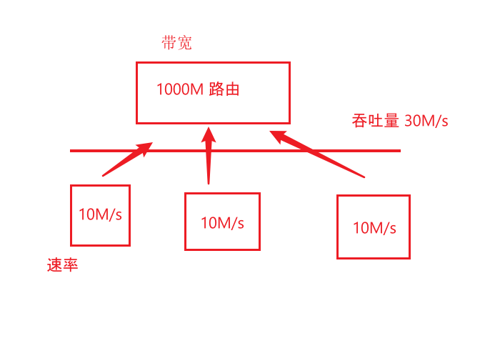
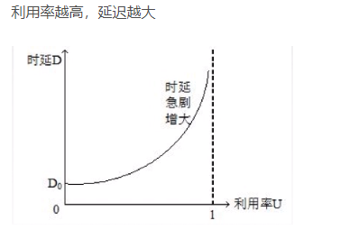
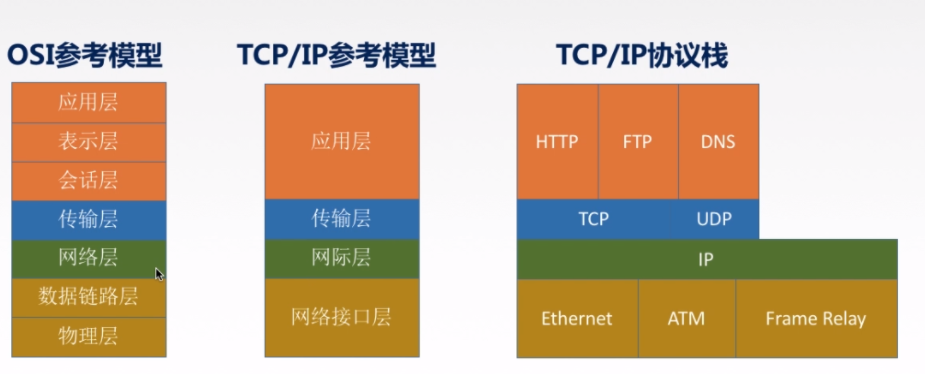
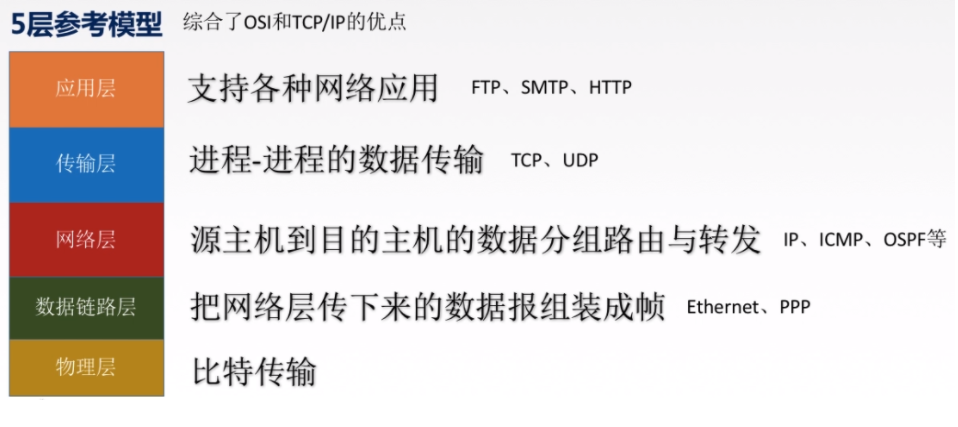
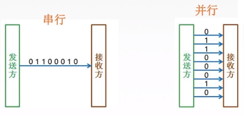
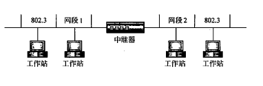
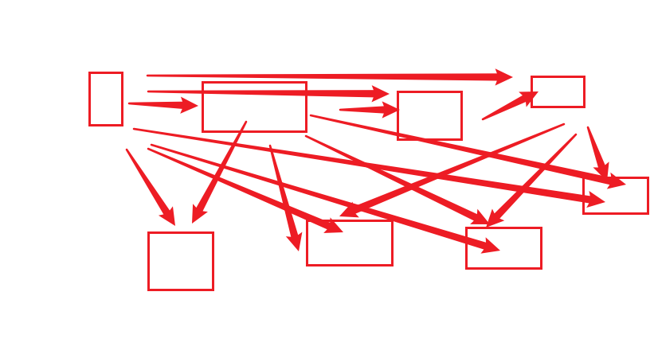
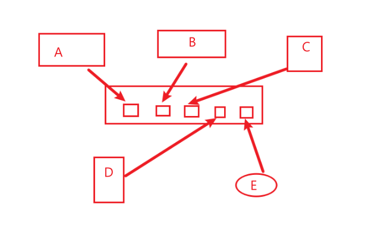

## 概述

### 1. 速率相关性能指标

#### 速率

在数字信道上传输数据位的速度。单位: b/s,Kb/s,Mb/s,Tb/s，
如果用字节表示，则是B/s,KB/s,MB/s,TB/s（1Byte=8Bit）

#### 带宽

单位同速率，指理想条件下的最高速率。

#### 吞吐量

单位时间内通过某个网络的数据总量。

#### 例子

比如说1000M宽带的路由器连着三部手机，每部手机都是10mb/s看片，那么速率就是10mb/s，带宽是宽带的1000m，路由器吞吐量是30mb/s。

### 2. 时延相关性能指标

#### 时延

| 名称     | 描述                                 | 计算公式                          |
| -------- | ------------------------------------ | --------------------------------- |
| 发送时延 | 数据从主机到信道上所用的时间         | 发送的数据长度/发送速率           |
| 传播时延 | 数据在信道上传播所花费的时间         | 信道长度/电磁波在信道上传播的速率 |
| 排队时延 | 数据在路由器前等待前面数据处理的时间 | 无计算方式                        |
| 处理时延 | 数据在路由器中处理需求的时间         | 无计算方式                        |

#### 时延带宽积

传播时延*带宽

表示整个链路上总共有多少bit的数据。

#### 往返时间RTT

从发送方发送数据开始，到接受方确认接受到数据为止花费的时间

= 传播时延*2 + 处理时延

### 3. 利用率

#### 信道利用率

=  有数据通过的时间/（有+无数据通过的时间）

#### 网络利用率

= 所有信道利用率加权求平均值

#### 时延和利用率的关系

### 4. 网络的分层结构

结合TCP/IP参考模型和OSI参考模型，现在广泛使用的是五层参考模型，如下图：

下面将按照这五层一次介绍。

## 物理层

主要负责传输数据比特流。

#### 码元

一个码元就是一个脉冲信号，如果这个脉冲信号是矩形脉冲，只有高低两个电平，则只能表示0或者1，也就是一个比特位。如果这个脉冲信号有8种变化（可以是电平高低，相位变化等），则可以表示3位比特位（000-111）一共八种。

**结论**：一个码元就是一个脉冲，一个脉冲有N中变化，则可以表示log2N位bit。

#### 波特（Baud）

一秒可以传输多少个码元。

#### 速率

分为**码元传输速率**和**信息传输速率**

信息传输速率就是b/s，就是我们平常说的**网速**

码元可以理解为几个比特的**集合**，所以信息传输速率（网速）=码元传输速率x码元所带信息量（多少比特）

#### 三种通讯模式

单工：只能一个发一个收，需要1条信道

半双工：都可以发或者收，但同一时间只能进行一个，需要2条信道

全双工：可以同时收和发，需要2条信道

#### 两种数据传输模式

串行：速度慢，省钱，适合远距离 

并行：速度快，花钱，适合近距离

#### 工作在物理层的设备

##### 中继器

当数据离开源在网络上传送时，它是转换为能够沿着网络介质传输的电脉冲或光脉冲的——这些脉冲称为信号（signal）。当信号沿着网络介质进行传送时， 随着经过的线缆越来越长，信号就会变得越来越弱，越来越差。中继器的目的是在**比特级别**对网络信号进行**再生和重定**时，从而使得它们能够在网络上传输更长的距离。

作用：对信号进行放大和整形，仅适用于以太网。

##### 集线器（HUB）

也有放大和整形的功能，可以看作是一个多端口的中继器。

HUB是网络中各个设备的通用连接点，它通常用于连接LAN的分段。HUB含有多个端口。每一个分组到达某个端口时，都会被复制到其他所有端口（广播），以便所有的LAN分段都能看见所有的分组。集线器并不认识信号、地址或数据中任何信息模式。

###### 集线器产生的思路：

一开始，电脑之前就通过网线连接，当电脑数量增多时，就会很乱，网络变得异常复杂。

所以我们在这些电脑的中间加一个设备——集线器。

每个电脑插在集线器的一个端口上。这样每台电脑发送数据都要通过集线器。比如A要给E发消息，那么A发出一个包，这个包到达hub之后，会被hub发往各个端口，BCDE都能收到，只有E收到这个包，发现包头的MAC标识的时自己，于是接收这个包，其他的BCD都丢弃这个包。

