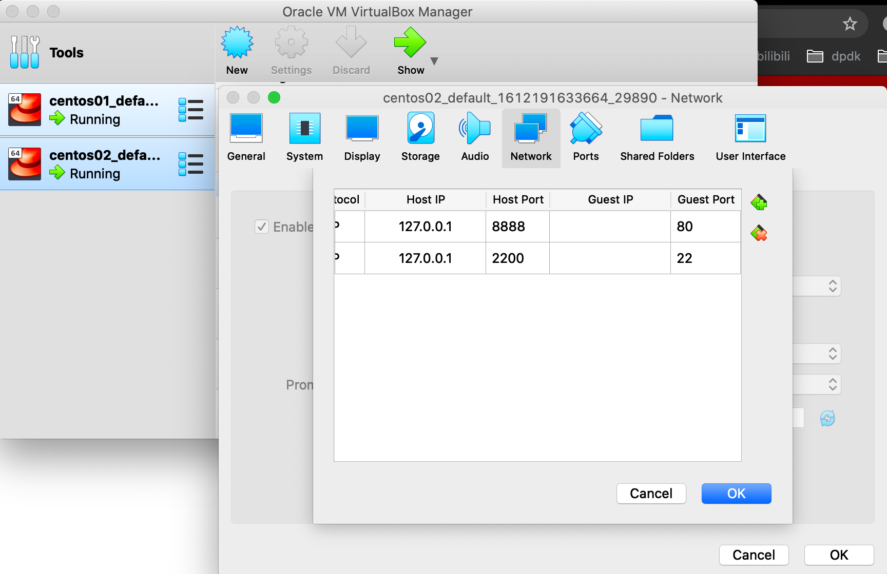
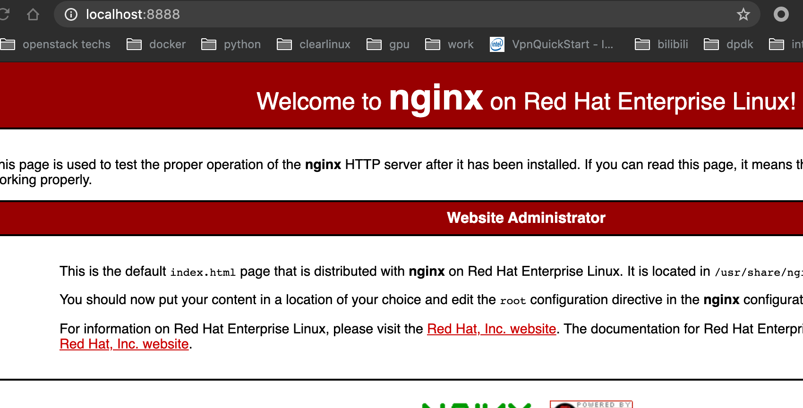
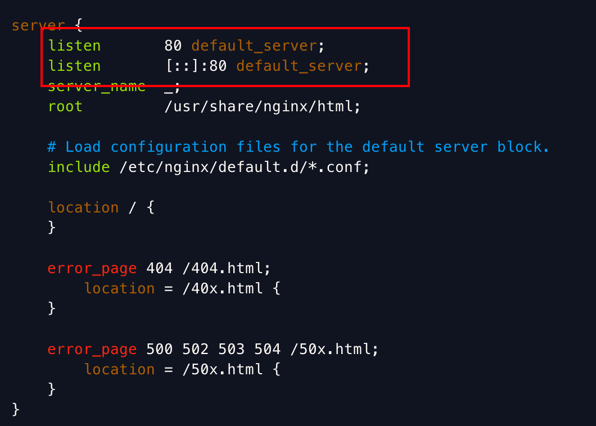

## 简介

- 反向代理
- 负载均衡
- 动静分离

## 安装

```shell
$ sudo yum install nginx
$ sudo systemctl start nginx.service
# 访问成功
$ curl localhost:80
```

**测试安装成功**

因为我的测试环境是vagrant vm，所以需要做一个端口映射，这样我们可以在host上访问。



成功！



```shell
$ nginx -h
nginx version: nginx/1.14.1
Usage: nginx [-?hvVtTq] [-s signal] [-c filename] [-p prefix] [-g directives]

Options:
...
  -s signal     : send signal to a master process: stop, quit, reopen, reload
  -p prefix     : set prefix path (default: /usr/share/nginx/)
  -c filename   : set configuration file (default: /etc/nginx/nginx.conf)
  -g directives : set global directives out of configuration file

# nginx -s stop 停止
# nginx -s quit 安全退出
# nginx -s reload 重新加载配置文件
```

### nginx配置文件

```shell
$ vim /etc/nginx/nginx.conf
```

可以看到nginx server是监听在80端口的，我们可以修改端口，然后用`nginx -s reload`来生效。




### 详解nginx.conf

 三部分

```shell
user  www;# 工作进程的属主
 worker_processes  4;# 工作进程数，一般与 CPU 核数等同
 
 #error_log  logs/error.log;
 #error_log  logs/error.log  notice;
 #error_log  logs/error.log  info;
 
 #pid        logs/nginx.pid;
 
 events {
    use epoll;#Linux 下性能最好的 event 模式
    worker_connections  2048;# 每个工作进程允许最大的同时连接数
 }
 
 http {
		upstream xxx{
				server1:port1
				server2:port3
		} 
		
		server {
				location / {
						proxy_pass xxx
				}
		}

 }
```

https://www.cnblogs.com/fengzhongzhuzu/p/8848115.html


### Nginx的负载均衡调度算法

#### weight轮询(默认，常用)

收到的请求**按照权重分配**到不同的后端服务器，即使在使用过程中，某一台后端服务器宕机，Nginx会自动将该服务器剔除出队列，请求受理情况不会受到任何影响。这种方式下，可以给不同的后端服务器设置一个权重值(weight)，用于调整不同的服务器上请求的分配率；权重数据越大，被分配到请求的几率越大；该权重值，主要是针对实际工作环境中不同的后端服务器硬件配置进行调整的。

#### ip_hash（常用）

每个请求按照发起客户端的ip的hash结果进行匹配，这样的算法下一个固定ip地址的客户端总会访问到同一个后端服务器，这也在一定程度上解决了集群部署环境下**session共享的**问题。

#### fair智能调整调度算法

动态的根据后端服务器的请求处理到响应的时间进行均衡分配，响应时间短处理效率高的服务器分配到请求的概率高，响应时间长处理效率低的服务器分配到的请求少；结合了前两者的优点的一种调度算法。但是需要注意的是Nginx默认不支持fair算法，如果要使用这种调度算法，请安装upstream_fair模块。

#### url_hash

按照访问的url的hash结果分配请求，每个请求的url会指向后端固定的某个服务器，可以在Nginx作为静态服务器的情况下提高缓存效率。同样要注意Nginx默认不支持这种调度算法，要使用的话需要安装Nginx的hash软件包。