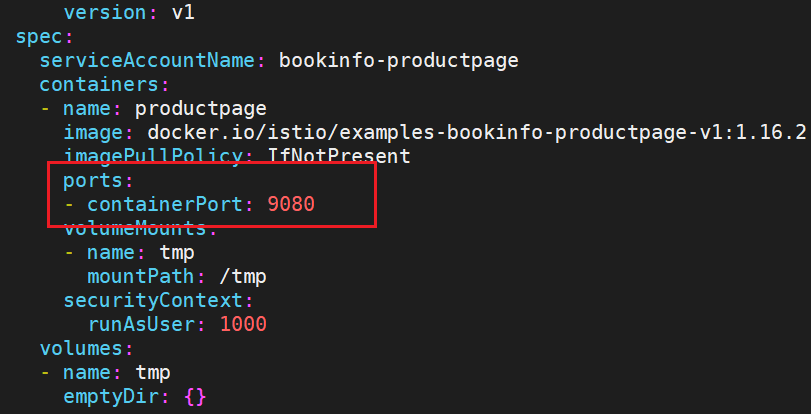
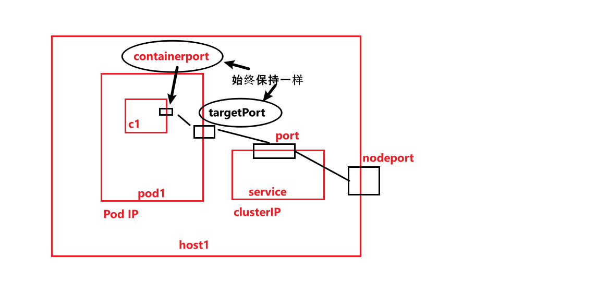

<!-- more -->

本文会通过container中的应用的几种访问方式来解释containerPort, targetPort, port, nodePort的关系和区别。

## containerPort

容器暴露的端口，在container spec里声明。



可以通过podIP:containerPort来访问容器内应用。

```shell
$ k get pod -owide
NAME    READY   STATUS    RESTARTS   AGE    IP                  NODE  
pod1    2/2     Running   0          133m   192.168.227.89   otcloud-node1   
pod2    2/2     Running   0          47m    192.168.227.97   otcloud-node1   
```

```shell
#可以访问容器内应用
curl 192.168.227.97:9080
```

**Notes：**

如果一个pod里声明了多个容器，那么每个容器暴露的端口必须不同，否则容器启动会失败。（Address already in use）

**更进一步**，因为一个pod里的所有容器都共享网络namespace，所以它们共享IP，和端口。


## targetPort

是**Service**资源里的一个概念，在service的声明中使用。

targetPort是Pod上的端口，从port/nodePort上来的数据，经过kube-proxy流入到后端pod的targetPort上，最后进入容器。

如果不指明targetPort，默认targetPort和service暴露的port一致。

下面是一个service的声明：

```yaml
apiVersion: v1
kind: Service
metadata:
  name: productpage
  labels:
    app: productpage
    service: productpage
spec:
  ports:
  - port: 9999  # clusterip:port 
    # targetPort: 9080 # 如果不写，默认是9999
    name: http
  selector:
    app: productpage
```

```shell
 k describe svc productpage
Name:              productpage
Namespace:         default
Labels:            app=productpage
                   service=productpage
Annotations:       <none>
Selector:          app=productpage
Type:              ClusterIP
IP Families:       <none>
IP:                10.97.239.58
IPs:               10.97.239.58
Port:              http  9999/TCP  
TargetPort:        9999/TCP  # 9999 和上面container暴露的接口不一致，访问一定会失败
Endpoints:         192.168.227.97:9999
Session Affinity:  None
Events:            <none>

```

**解决方法：**

1. 显式地声明targetPort: 9080
2. 使用9080作为port，这样targetport也是9080，就可以和container port连接起来。

这里我们把targetPort显式的写成9080，会得到：

```shell
 k describe svc productpage
Name:              productpage
Namespace:         default
Labels:            app=productpage
                   service=productpage
Annotations:       <none>
Selector:          app=productpage
Type:              ClusterIP
IP Families:       <none>
IP:                10.97.239.58 # cluster IP！
IPs:               10.97.239.58
Port:              http  9999/TCP # 注意！
TargetPort:        9080/TCP  # 注意！
Endpoints:         192.168.227.97:9080 # 注意！
Session Affinity:  None
Events:            <none>
```

这个service的细节要好好研究一下。

**IP：**Service的cluster IP。

**Port：**Service的cluster IP暴露的接口。

**TargetPort：**容器暴露的接口。

**Endpoint：** podIP:targetPort，注意这里是targetPort，不是containerPort。

又有访问容器内应用的新方式：

```shell
# clusterIP:port
curl 10.97.239.58:9999

# by endpoint, 跟containerPort里讲到的实际是一样的
curl 192.168.227.97:9080
```


## Port

上面讲的差不多了，也是**service**里的概念，是指在clusterIP上暴露的端口，是一个虚拟的东西。

clusterIP：虚拟的IP，在集群内可以相互访问。它只是存在service的规则当中。 **注意，它不是podIP。**


## nodePort

nodePort 提供了**集群外**部客户端访问 Service 的一种方式，nodePort 提供了集群外部客户端访问 Service 的端口，通过 `nodeIP:nodePort` 提供了外部流量访问k8s集群中service的入口。

```shell
$ k get svc -owide
NAME          TYPE        CLUSTER-IP     EXTERNAL-IP   PORT(S)         AGE    SELECTOR
productpage   NodePort    10.97.239.58   <none>       9999:30066/TCP  25m app=productpage


$ k describe svc productpage
Name:                     productpage
Namespace:                default
Labels:                   app=productpage
                          service=productpage
Annotations:              <none>
Selector:                 app=productpage
Type:                     NodePort
IP Families:              <none>
IP:                       10.97.239.58
IPs:                      10.97.239.58
Port:                     http  9999/TCP
TargetPort:               9080/TCP
NodePort:                 http  30066/TCP  # 在host node上暴露的端口
Endpoints:                192.168.227.97:9080
Session Affinity:         None
External Traffic Policy:  Cluster
Events:                   <none>

```

又一种新的访问方式：

```shell
#hostIP:nodeport
curl localhost:30066
```


总结：



三种访问方式以及范围：

| 方式             | 范围                |
| ---------------- | ------------------- |
| podIP:targetPort | 和pod在同一个网络下 |
| clusterIP:port   | 在集群中            |
| hostIP:nodeport  | 主机之间也可以访问  |


