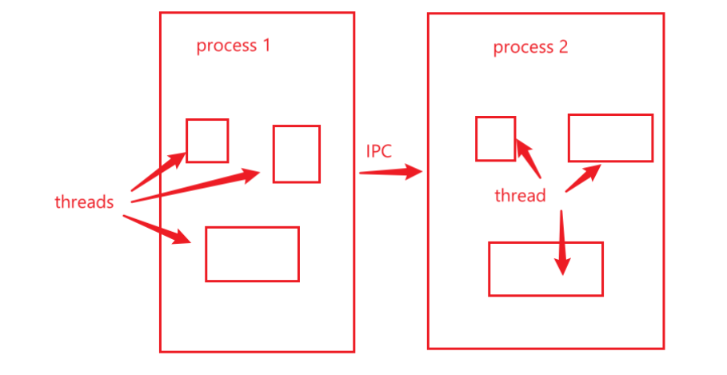
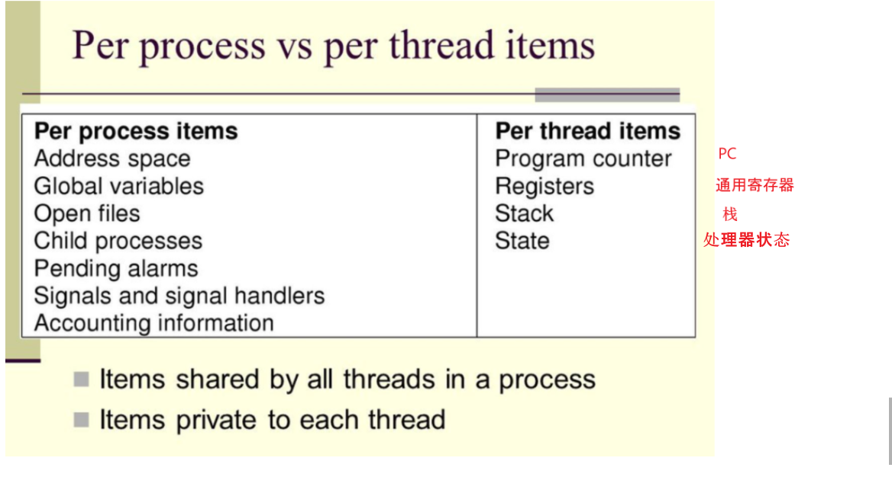

> 参考：https://cloud.tencent.com/developer/article/1688297

## 简单的理解

对于操作系统来说，一个任务就是一个进程（**Process**），比如打开一个浏览器就是启动一个浏览器进程，打开一个记事本就启动了一个记事本进程，打开两个记事本就启动了两个记事本进程，打开一个Word就启动了一个Word进程。

有些进程还不止同时干一件事，比如Word，它可以同时进行打字、拼写检查、打印等事情。在一个进程内部，要同时干多件事，就需要同时运行多个“子任务”，我们把进程内的这些“子任务”称为线程（**Thread**）。

## 并行和并发

并行是真正的同时运行，需要多核。

并发只是看起来同时运行，最常见的就是**时间片轮转调度算法**。

## 进程和线程的区别

**共享同一地址空间**（也就是同样的**动态内存，映射文件，目标代码等等**），**打开的文件队列和其他内核资源**。

##### 

|                             进程                             |                             线程                             |
| :----------------------------------------------------------: | :----------------------------------------------------------: |
|                       有独立的地址空间                       | 有自己的栈和局部变量，但没有单独的地址空间。 同一进程中的多个线程共享代码段（代码和常量），数据段（全局变量和静态变量），扩展段（堆存储）。 但是每个线程拥有自己的栈段，栈段又叫运行时段，用来存放所有局部变量和临时变量。） |
|              在保护模式下不会对其它进程产生影响              |                一个线程死掉就等于整个进程死掉                |
|                      拥有独立的内存单元                      |                        共享进程的内存                        |
| 管道、系统IPC（包括[消息队列](https://cloud.tencent.com/product/cmq?from=10680)、信号量、信号、共享内存等）、以及套接字socket |      可以直接读写进程数据段和全局变量（互斥锁，信号量）      |
|                         上下文切换慢                         |                       进程上下文切换快                       |
|               **进程是操作系统分配资源的单位**               |              **是CPU调度和分派执行的基本单位**               |
|         进程编程调试简单可靠性高，但是创建销毁开销大         |     线程正相反，开销小，切换速度快，但是编程调试相对复杂     |

创建线程的代价比创建进程的代价小很多，如下图：

