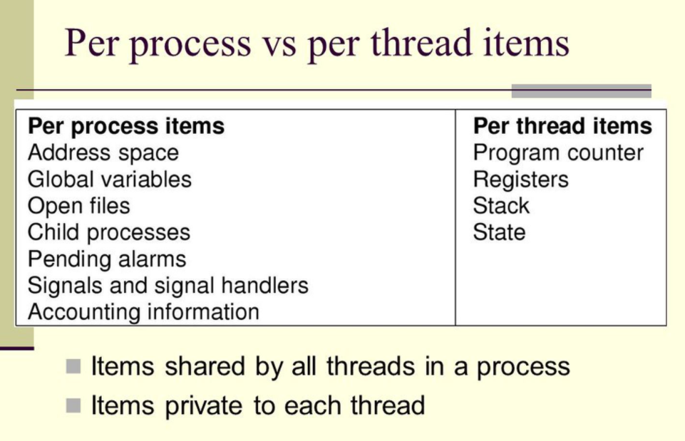

## 简单的理解

对于操作系统来说，一个任务就是一个进程（**Process**），比如打开一个浏览器就是启动一个浏览器进程，打开一个记事本就启动了一个记事本进程，打开两个记事本就启动了两个记事本进程，打开一个Word就启动了一个Word进程。

有些进程还不止同时干一件事，比如Word，它可以同时进行打字、拼写检查、打印等事情。在一个进程内部，要同时干多件事，就需要同时运行多个“子任务”，我们把进程内的这些“子任务”称为线程（**Thread**）。

## 并行和并发

并行是真正的同时运行，需要多核。

并发只是看起来同时运行，最常见的就是**时间片轮转调度算法**。

## 进程和线程的区别

| 进程                               | 线程                                               |
| ---------------------------------- | -------------------------------------------------- |
| 有独立的地址空间                   | 有自己的堆栈和局部变量，但没有单独的地址空间       |
| 在保护模式下不会对其它进程产生影响 | 一个线程死掉就等于整个进程死掉                     |
| 拥有独立的内存单元                 | 共享同一个进程里的内存                             |
| IPC                                | 可以直接读写进程数据段和全局变量（互斥锁，信号量） |
| 上下文切换慢                       | 进程上下文切换快                                   |
| **进程是操作系统分配资源的单位**   | **是CPU调度和分派执行的基本单位**                  |

创建线程的代价比创建进程的代价小很多，如下图：

