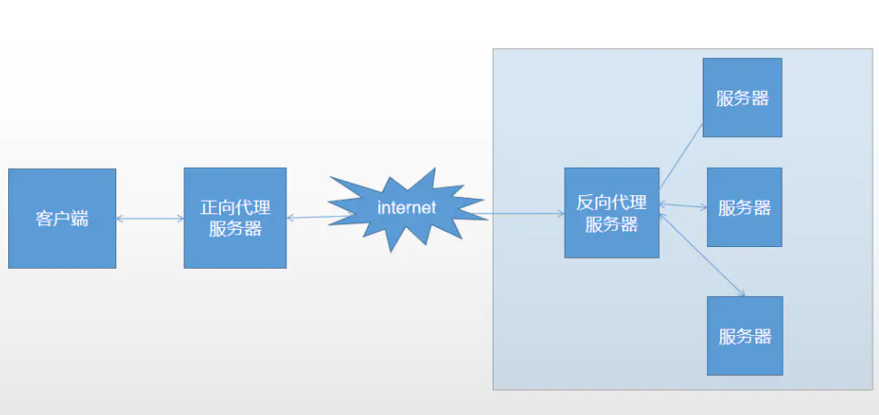

## 为什么需要proxy server?

1. 监控，内容过滤
   - 公司的proxy server可以清楚的知道，你的流量要访问什么网站。proxy server可以禁掉一些网址，或者redirect到一些提示页面。
   - 公司的proxy server可以监控你每天都在访问什么网站，花了多长时间。
2. 节约带宽，节省成本
   - 在proxy server上会有一些cache，里面存放了最近访问的website的数据，如果有1000个request通过同一个proxy server访问website A，这时如果proxy server上有website A的最新数据在cache里，就可以直接返回给这1000个client。如果proxy server上没有，也只需要发一个website A的请求，然后把返回数据放在cache里。

3. 提高性能
   - 通过代理服务器的缓存（比如 CDN）和负载均衡（比如 nginx lb）功能，服务器端可以加速请求的访问，在更快的时间内返回结果）

4. 安全和隐私

   - 有一些proxy server可以隐藏掉client的IP等个人信息，这样通过proxy访问网站，web server并不能知道是谁在真正的访问它。
   - 公司可以在内网和外网之间通过代理进行转发，这样不仅对外隐藏了实现的细节，而且可以在代理层对爬虫、病毒性请求进行过滤，保护内部服务。

   - 还可以加密数据

> 风险：
>
> 因为所有client的请求都要通过proxy server访问internet，所以有数据泄露的风险。也有一些技术可以实现数据加密，规避这种risk，后面会讲到。


## 代理服务器的分类：

1. #### 按照匿名功能分类（是否具有隐藏IP的功能）
   
   - 非匿名（和透明代理的区别？？？）
   - 匿名：使用此种代理时，虽然被访问的网站不能知道你的 IP 地址，但仍然可 以知道你在使用代理，有些侦测 IP 的网页也仍然可以查到你的 IP。
   - 高度匿名：使用此种代理时，被访问的网站不知道你的 IP 地址，也不知道你在使用代理进行访问。此种代理的隐藏 IP 地址的功能最强。
   
   - 透明代理（简单代理）：透明代理的意思是客户端根本不需要知道有代理服务器的存在，它改编你的 request fields（报文），并会传送真实 IP。web server会直接获得client的IP，并且知道client是通过proxy访问的它。
   
3. #### 按代理服务器的用途分类
   
   - HTTP代理
   - SSL代理
   - HTTP CONNECT代理
   - FTP代理
   - POP3代理
   - Telnet代理
   - Socks代理
   - 等等等等
   
3. #### 按照相对于client-server的角色分类

   ##### 正向代理

   代理对客户端不是透明的，客户端需要知道代理的地址并且手动配置。配置了代理，浏览器在发送请求的时候会对报文做特殊的修改。

   ##### 反向代理

   说客户端一般不知道代理的存在，认为自己是直接和服务器通信。我们大部分访问的网站就是反向代理服务器，反向代理服务器会转发到真正的服务器，一般在反向代理这一层实现**负载均衡**和**高可用**的功能。而且这里也可以看到，客户端是不会知道真正服务器端的 ip 地址和端口的，这在一定程度上起到了安全保护的作用。

   

## 代理具体做什么？
```shell
- 修改 HTTP 请求：url、header、body  
- 过滤请求：根据一定的规则丢弃、过滤请求 
- 决定转发到哪个后端（可以是静态定义的，也可以是动态决定） #nginx etc.
- 保存服务器的应答，后续的请求可以直接使用保存的应答 # cache on proxy server
- 修改应答：对应答做一些格式的转换，修改数据，甚至返回完全不一样的应答数据  #security issue?
- 重试机制，如果后端服务器暂时无法响应，隔一段时间重试
- ……
```


普通代理

隧道代理


## 代理和网关的区别