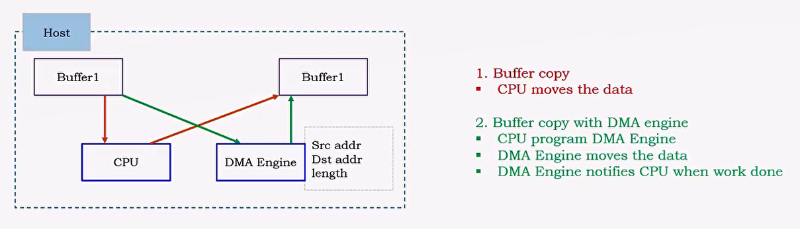
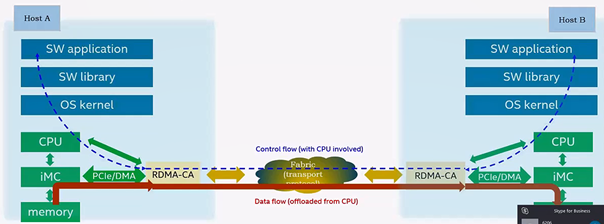
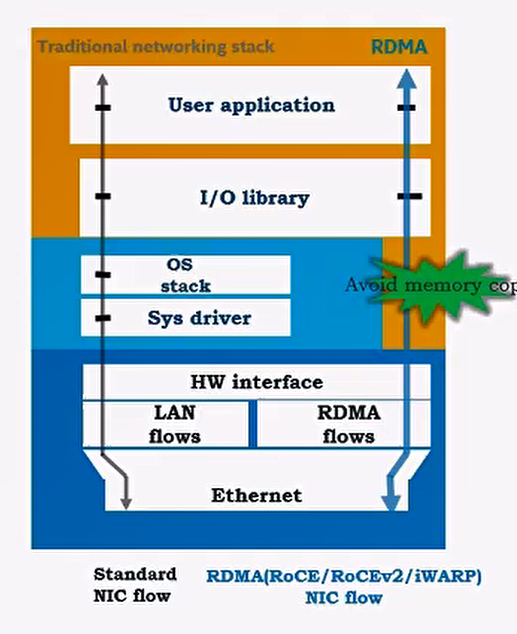
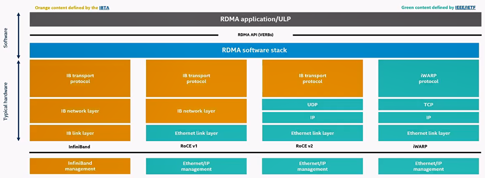

# Overview

## DMA

在同一台Host上，不通过CPU的move来做数据搬移。 

Free up CPU

## RDMA

Remote DMA, cross host. 

secure direct memory to memory data communication without CPU 

iMC: intergrated memory controller.

blue dot line: control path, need cpu to setup

red line: data path, without cpu

map NIC hw resource into user space

verbs API

message level  

# Protocol Introduction

 

# Details（ROCEv2）

iscsi/scsi over rdma

RDMA provides Channel based IO.  This channel allows an application using an RDMA device
to directly read and write remote virtual memory.  

The registration process pins the memory pages (to prevent the pages from being swapped out
and to keep physical <-> virtual mapping).  

The registration process writes the virtual to physical address table to the network adapter.
When registering memory, permissions are set for the region. Permissions are local write, remote
read, remote write, atomic, and bind  

Every MR has a remote and a local key (r_key, l_key). Local keys are used by the local HCA to
access local memory, such as during a receive operation. Remote keys are given to the remote
HCA to allow a remote process access to system memory during RDMA operations.  

Scatter Gather  - > what's the size??

If we have completion with bad status in a WR, the rest of the completions will be all be bad (and
the Work Queue will be moved to error state)   - > why ??