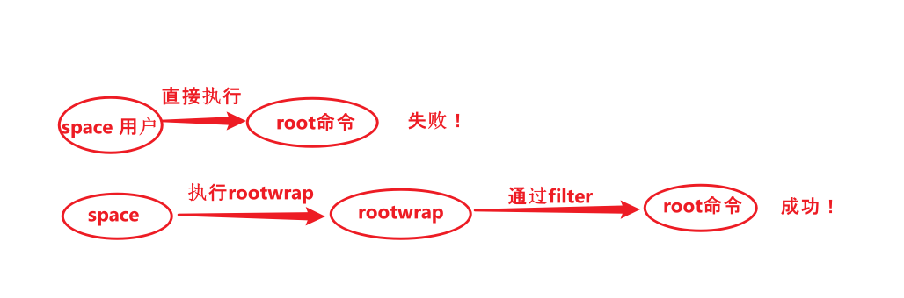

## rootwrap

rootwrap是一个控制nova,neutron等普通用户权限，并且帮助提权的工具。

“以普通用户运行，只对**特定命令**提供免密执行权限”。

**原因：**
例如就network服务而言就有:`ip`,`ovs-vsctl`,`iptables`,`dnsmasq`,`brctl`等等，这些命令在linux中都是需要以root身份来运行的,如果是普通用户(space)通常的做法是在命令前加`sudo`切换到root身份再执行这些命令，但是这个方法在执行命令的时候需要输入密码确认操作，为了避免输入密码，我们需要配置一下sudoers。

**缺点：**

1. command多了，权限各不相同，会造成/etc/sudoers.d/的大量修改。
2. 而且我们只希望在执行个别command（或者传递个别参数）的时候进行提权。


所以rootwrap应运而生。

## neutron如何使用rootwrap

以neutron为例详解；

```shell
sudo systemctl status devstack@q-agt.service
● devstack@q-agt.service - Devstack devstack@q-agt.service
   Loaded: loaded (/etc/systemd/system/devstack@q-agt.service; enabled; vendor preset: disabled)
   Active: active (running) since Mon 2021-02-08 05:41:41 UTC; 3 months 3 days ago
 Main PID: 1107451 (neutron-openvsw)
    Tasks: 4 (limit: 1229056)
   Memory: 134.0M
   CGroup: /system.slice/system-devstack.slice/devstack@q-agt.service
           ├─1107451 neutron-openvswitch-agent (/usr/bin/python3.6 /usr/local/bin/neutron-openvswitch-agent --config-file /etc/n>
           └─1107518 ovsdb-client monitor tcp:127.0.0.1:6640 Interface name,ofport,external_ids --format=json
```

可以看到q-agt的service所在路径为`/etc/systemd/system/devstack@q-agt.service`, 内容如下：

```shell
[Unit]
Description = Devstack devstack@q-agt.service

[Service]
ExecReload = /usr/bin/kill -HUP $MAINPID
TimeoutStopSec = 300
KillMode = process
ExecStart = /usr/local/bin/neutron-openvswitch-agent --config-file /etc/neutron/neutron.conf --config-file /etc/neutron/plugins/ml2/ml2_conf.ini
User = space # 以space用户运行

[Install]
WantedBy = multi-user.target
```


建议的方法是在/etc/sudoers.d/目录下新建一个文件，例如：neutron_sudoers

```shell
cat /etc/sudoers.d/neutron-rootwrap
space ALL=(root) NOPASSWD: /usr/local/bin/neutron-rootwrap /etc/neutron/rootwrap.conf *
space ALL=(root) NOPASSWD: /usr/local/bin/neutron-rootwrap-daemon /etc/neutron/rootwrap.conf
```

意思是： space在所有主机上（ALL）可以以root身份运行 `/usr/local/bin/nova-rootwrap /etc/nova/rootwrap.conf + 任何命令` ，而且不需要密码。  这就是wrap的意思，当nova service想要运行一些root权限的命令时，就会这个wrapper来完成提权。



### filters

```shell
cat /etc/nova/rootwrap.conf

[DEFAULT]
filters_path=/etc/neutron/rootwrap.d  # 命令filter所在目录
exec_dirs=/sbin,/usr/sbin,/bin,/usr/bin,/usr/local/bin,/usr/local/sbin,/etc/neutron/kill_scripts,/usr/local/bin # 命令的PATH，默认是OS_PATH
...
```

以openvswtich.filters为例：

```shell
cat /etc/neutron/rootwrap.d/openvswitch-plugin.filters
[Filters]
# openvswitch-agent
ovs-ofctl: CommandFilter, ovs-ofctl, root
kill_ovsdb_client: KillFilter, root, /usr/bin/ovsdb-client, -9
ovsdb-client: CommandFilter, ovsdb-client, root

# ip_lib
ip: IpFilter, ip, root
ip_exec: IpNetnsExecFilter, ip, root

# needed for FDB extension
bridge: CommandFilter, bridge, root
```

filters有几类：

CommandFilter, RegExpFilter, KillFilter, PathFilter, EnvFilter, ReadFileFilter, KillFilter, IpFilter,  IpNetnsExecFilter, IpNetnsExecFilter

rootwrap的运行模式有两种：

1. Stand alone
2. daemon （常见）

解释第二种：

从1.3.0版本开始，oslo.rootwrap支持“daemon”模式。 在这种模式下，rootwrap将启动，读取config并等待以root特权运行的命令到来。


它的构造函数需要一个可以传递给Popen(process open)的列表，以创建rootwrap守护进程。 例如，它将是`[“ sudo”，“ nova-rootwrap-daemon”，“ /etc/neutron/rootwrap.conf”]`这个list传入构造函数。

### rootwrap启动入口

```shell
[entry_points]
console_scripts =
    neutron-rootwrap = oslo_rootwrap.cmd:main
    neutron-rootwrap-daemon = oslo_rootwrap.cmd:daemon
```

## 后继者 oslo.privsep

oslo.rootwrap的缺点：虽然能做到针对个别command提权，但是提权之后在哪里都可以root运行这些command，会造成一个安全问题。 

oslo.privsep限制了可以提权的context。 nova现在都是用oslo.privsep这种方式提权的。

### nova如何用privsep函数替换rootwrap

#### 例子

```
chmod: CommandFilter, chmod, root
```

上面的chmod过滤器可以替换为调用os.chmod（）的函数， 最好将每个chmod rootwrap调用替换为一个狭窄的privsep函数，以将其限制为特定文件。

```python
/opt/stack/nova/nova/privsep/__init__.py

"""Setup privsep decorator."""

from oslo_privsep import capabilities
from oslo_privsep import priv_context

sys_admin_pctxt = priv_context.PrivContext(
    'nova',                                      # prefix, 如果不以nova开头就报错
    cfg_section='nova_sys_admin',                
    pypath=__name__ + '.sys_admin_pctxt',
    capabilities=[capabilities.CAP_CHOWN,
                  capabilities.CAP_DAC_OVERRIDE,
                  capabilities.CAP_DAC_READ_SEARCH,
                  capabilities.CAP_FOWNER,
                  capabilities.CAP_NET_ADMIN,
                  capabilities.CAP_SYS_ADMIN], # == sudo right
) 

# 同时这个文件里还定义了entrypoint这个装饰器
```


```python
@nova.privsep.sys_admin_pctxt.entrypoint  # entrypoint是privsep的一个decorator，用来
def mount(fstype, device, mountpoint, options):
    mount_cmd = ['mount']
    if fstype:
        mount_cmd.extend(['-t', fstype])
    if options is not None:
        mount_cmd.extend(options)
    mount_cmd.extend([device, mountpoint])
    return processutils.execute(*mount_cmd)
```

把mount这个动作放在一个narrow的函数里，加`@nova.privsep.sys_admin_pctxt.entrypoint `来提权，这样可以防止过度提权。 

>  As an example, this [patch series](https://review.openstack.org/#/q/project:openstack/nova+branch:master+topic:my-own-personal-alternative-universe) is work-in-progress to transition Nova from rootwrap to privsep.

```shell
vim /etc/nova/rootwrap.d/compute.filters
# nova-rootwrap command filters for compute nodes
# This file should be owned by (and only-writeable by) the root user

[Filters]
# os_brick.privileged.default oslo.privsep context
privsep-rootwrap-os_brick: RegExpFilter, privsep-helper, root, privsep-helper, --config-file, /etc/(?!\.\.).*, --privsep_context, os_brick.privileged.default, --privsep_sock_path, /tmp/.*

# nova.privsep.sys_admin_pctxt oslo.privsep context
privsep-rootwrap-sys_admin: RegExpFilter, privsep-helper, root, privsep-helper, --config-file, /etc/(?!\.\.).*, --privsep_context, nova.privsep.sys_admin_pctxt, --privsep_sock_path, /tmp/.*
~
#  privsep-helper = oslo_privsep.daemon:helper_main 
#  """Start privileged process, serving requests over a Unix socket."""
```