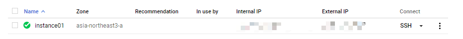
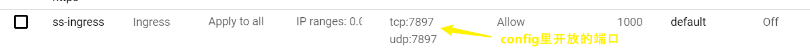

> 工具：
> shadowsocks-libev
> google vm

<!-- more -->

## google vm的基本配置

### 准备工作

具体创建步骤略，需要一个绑定一个海外银行卡。

下面是我创建的虚拟机。



创建好之后可以去站长之家ping一下，保证在国内大多数地方可以ping通。如果ping不通删了重建。

然后通过左边的`ssh`登录上去。

### 安装ssr

#### dependency

```shell
sudo apt update
sudo apt-get install --no-install-recommends gettext build-essential autoconf libtool libpcre3-dev asciidoc xmlto libev-dev libc-ares-dev automake libmbedtls-dev libsodium-dev
```

#### install from source

```shell
sudo apt install git
git clone https://github.com/shadowsocks/shadowsocks-libev.git
sudo apt-get install --no-install-recommends gettext build-essential autoconf libtool libpcre3-dev asciidoc xmlto libev-dev libc-ares-dev automake libmbedtls-dev libsodium-dev
cd shadowsocks-libev/ ./autogen.sh
```

missing makefile - >  `git submodule update --init --recursive`

```shell
./configure
# maybe not need：
make
sudo make install
dpkg-buildpackage -b -us -uc -I

#报错: missing pkg-config
sudo apt-get install -y pkg-config debhelper 

# install deb pkg
cd .. && sudo dpkg -i shadowsocks-libev*.deb
```

####  edit config file 

```shell
vim /etc/shadowsocks-libev/config.json 
{
  "server":["::1", "127.0.0.1"], # internal IP
  "mode":"tcp_and_udp",
  "server_port":8388, # need enable this port's ingress in firewall
  "local_port":1080,
  "password":"password",
  "timeout":86400,
  "method":"aes-256-cfb"
}

# restart service
sudo systemctl restart shadowsocks-libev
```

#### firewall configuration



### 安装客户端

#### 手机

shadowrocket

#### MacOS

shadowsocks-NG

need local socks proxy


