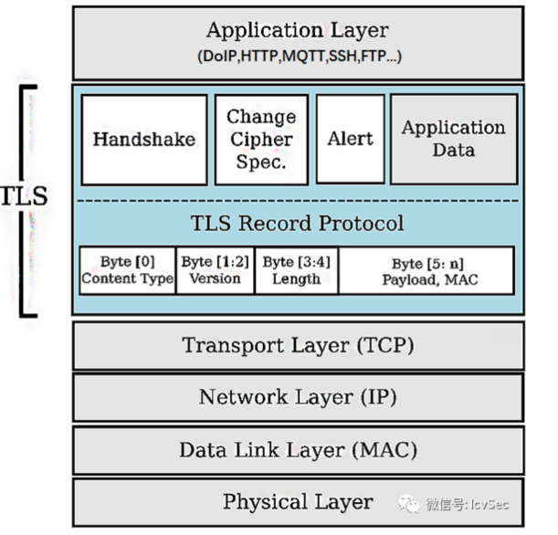

## TLS

源于SSL，后改名TLS（Transport Layer Security）

1. 可以实现通讯双方的身份认证，应用数据加密。
2. 与上层的应用层协议无耦合，应用层协议能透明地运行在TLS协议构建的安全通道之上。

TLS由记录层（记录协议， record protocol）和握手协议层（握手协议、密钥变更协议、告警协议，应用数据协议）组成。

HTTPS = HTTP over TLS.

散列函数 Hash、对称加密和非对称加密，其利用非对称加密实现身份认证和密钥协商，对称加密算法采用协商的密钥对数据加密，基于散列函数验证信息的完整性

mTLS