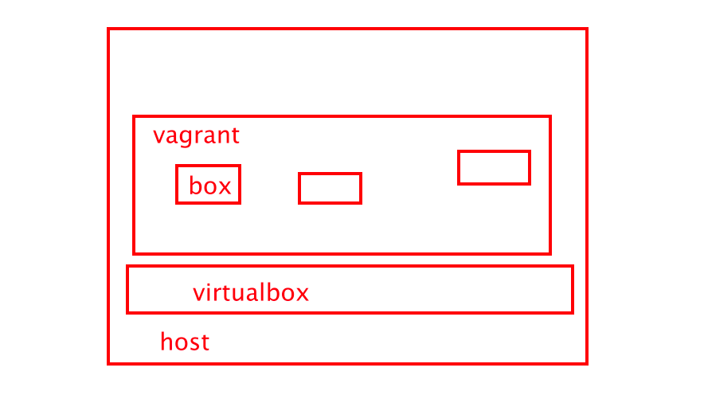
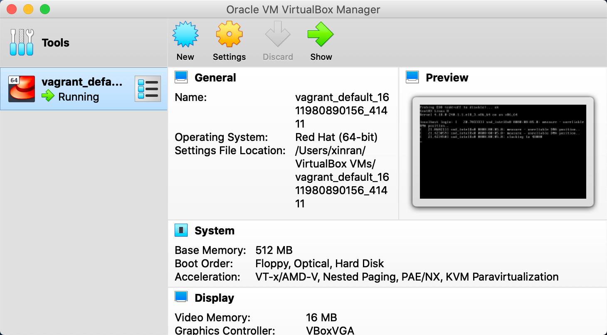

<!-- more -->

## vagrant介绍

基于ruby，用于创建和部署虚拟化开发环境。它 使用Oracle的开源[VirtualBox](https://baike.baidu.com/item/VirtualBox)虚拟化系统，使用 Chef创建自动化虚拟环境。我们可以使用它来干如下这些事：

- 建立和删除虚拟机

- 配置虚拟机运行参数

- 管理虚拟机运行状态

- 自动配置和安装开发环境ß

- 打包和分发虚拟机运行环境

　　Vagrant的运行，需要**依赖**某项具体的**虚拟化技术**，最常见的有VirtualBox以及VMWare两款，早期，Vagrant只支持VirtualBox，后来才加入了VMWare的支持。现在vagrant支持更多的虚拟化系统，包括libvirt，kvm，qemu，vmware，甚至docker。但还是以virtualbox为主。



### vagrant和virtualbox

virtualbox本身也可以创建vm，只是相对麻烦，vagrant可以调用virtualbox的接口更加方便的创建vm。


### 在mac上安装vagrant+virtualbox

#### 安装vagrant

```shell
brew install vagrant
vagrant -v
```

#### 安装virtualbox

国外的dmg文件下载很慢，我是国内随便找了一个[源](https://ftp-new-pc.pconline.com.cn/pub/download/201909/pconline1567810102832.dmg?md5=dLIvaxUfMIGWrr-oloz2Jg&expires=1611979478)。



virtualbox本身也可以创建vm，但是比较复杂。


#### 下载box

vagrant中box的概念，类似于docker image。我们可以通过指定box来启动一个vagrant vm。

```shell
# 先下载box file到本地，再add
vagrant box add centos8 /path/to/boxfile

# 直接从网上下载box file，并且add
vagrant box add centos8 url_to_box_file
```

vagrantbox的官方下载地址从国内连接很慢，我找到了一些国内的源。

>centos 8
>
>http://mirrors.ustc.edu.cn/centos-cloud/centos/8/vagrant/x86_64/images/CentOS-8-Vagrant-8.3.2011-20201204.2.x86_64.vagrant-virtualbox.box
>
>ubuntu1804
>
>https://mirrors.tuna.tsinghua.edu.cn/ubuntu-cloud-images/bionic/current/bionic-server-cloudimg-amd64-vagrant.box

#### 启动虚拟机

```shell
$ vagrant box add centos8 http://mirrors.ustc.edu.cn/centos-cloud/centos/8/vagrant/x86_64/images/CentOS-8-Vagrant-8.3.2011-20201204.2.x86_64.vagrant-virtualbox.box
==> box: Box file was not detected as metadata. Adding it directly...
==> box: Adding box 'centos8' (v0) for provider:
    box: Downloading: http://mirrors.ustc.edu.cn/centos-cloud/centos/8/vagrant/x86_64/images/CentOS-8-Vagrant-8.3.2011-20201204.2.x86_64.vagrant-virtualbox.box
==> box: Successfully added box 'centos8' (v0) for 'virtualbox'!


$ vagrant box list
centos8    (virtualbox, 0)
ubuntu1804 (virtualbox, 0)

# 创建本地vagrant目录
$ cd vagrant

# 这一步会创建一个vm的Vagrantfile，所有关于vm的配置都在这个文件里。
$ vagrant init centos8
A `Vagrantfile` has been placed in this directory. You are now
ready to `vagrant up` your first virtual environment! Please read
the comments in the Vagrantfile as well as documentation on
`vagrantup.com` for more information on using Vagrant.
 
 # 启动vm
$ vagrant up
Bringing machine 'default' up with 'virtualbox' provider...
==> default: Importing base box 'centos8'...
==> default: Matching MAC address for NAT networking...
==> default: Setting the name of the VM: vagrant_default_1611980890156_41411
==> default: Clearing any previously set network interfaces...
==> default: Preparing network interfaces based on configuration...
    default: Adapter 1: nat
    default: Adapter 2: hostonly
==> default: Forwarding ports...
    default: 22 (guest) => 2222 (host) (adapter 1)  # 端口映射, 如果起了多个vagrant vm，那么各个
    																								# vm 会映射到host的不同端口
==> default: Booting VM...
==> default: Waiting for machine to boot. This may take a few minutes...
    default: SSH address: 127.0.0.1:2222
    default: SSH username: vagrant
    default: SSH auth method: private key
    default:
    default: Vagrant insecure key detected. Vagrant will automatically replace
    default: this with a newly generated keypair for better security.
    default:
    default: Inserting generated public key within guest...
    default: Removing insecure key from the guest if it's present...
    default: Key inserted! Disconnecting and reconnecting using new SSH key...
==> default: Machine booted and ready!
==> default: Checking for guest additions in VM...
    default: No guest additions were detected on the base box for this VM! Guest
    default: additions are required for forwarded ports, shared folders, host only
    default: networking, and more. If SSH fails on this machine, please install
    default: the guest additions and repackage the box to continue.
    default:
    default: This is not an error message; everything may continue to work properly,
    default: in which case you may ignore this message.
==> default: Configuring and enabling network interfaces...
==> default: Rsyncing folder: /Users/xinran/vagrant/ => /vagrant

# 登入/退出vm
$ vagrant ssh
Last login: Sat Jan 30 04:28:57 2021 from 10.0.2.2
[vagrant@localhost ~]$ 
[vagrant@localhost ~]$ exit
logout
Shared connection to 127.0.0.1 closed.

# 查看host上的2222端口
$ lsof -i:2222
COMMAND     PID   USER   FD   TYPE             DEVICE SIZE/OFF NODE NAME
VBoxHeadl 13238 xinran   16u  IPv4 0x294cd01b85b191f5      0t0  TCP localhost:rockwell-csp2 (LISTEN)
VBoxHeadl 13238 xinran   20u  IPv4 0x294cd01b95fd8815      0t0  TCP localhost:rockwell-csp2->localhost:63021 (ESTABLISHED)
ssh       13880 xinran    3u  IPv4 0x294cd01b94ae9e35      0t0  TCP localhost:63021->localhost:rockwell-csp2 (ESTABLISHED)
ssh       13894 xinran    3u  IPv4 0x294cd01b94ae9e35      0t0  TCP localhost:63021->localhost:rockwell-csp2 (ESTABLISHE
```

> Note: 在下载box image时，要找到对应provider的box。我第一次下载成了libvirt provider的box，然后vagrant init就失败了，因为我的host上装的是virtualbox作为provider。