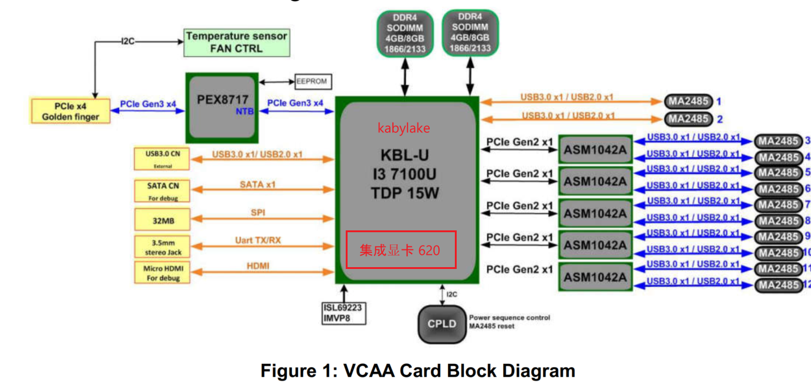
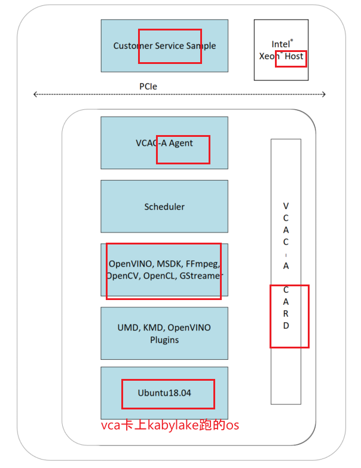
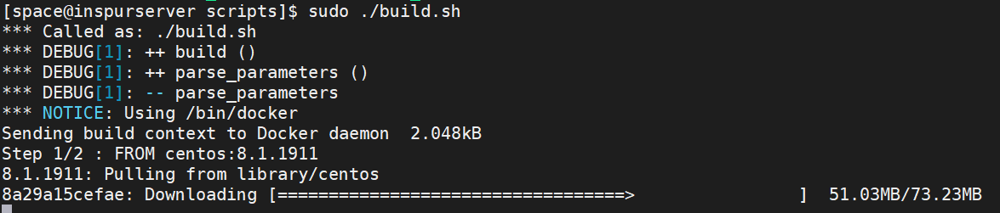
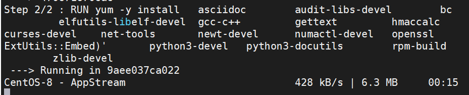

## vca卡的内部结构



- 一块kabylake CPU，上面带一个Intel GFX 610集成显卡。

- 12个movidius VPU：
  - 其中两个通过USB连接到CPU上
  - 剩下的10个通过PCI-USB bridge和CPU通信
    - PCI-USB bridge ：The **ASM1042A** is ASMedia’s new generation of Universal Serial Bus 3.0 extended host controller, bridging PCI Express to two ports of USB3.0

- 一个PCIe switch：为host提供NTB
  - NTB（Non-Transparent-Bridge）


## Host上vca software安装



service跑在host上，agent和其他的workload都跑在vca卡上，卡上有个单独的os，ubuntu1804。

### 下载software packages源码


```shell
$ git clone https://github.com/OpenVisualCloud/VCAC-SW-Analytics.git -b release/VCAC-A/R6
$ tree -L 2
.
├── Documents                   # 平平无奇的文档
│   ├── VCAC-Analytics-releasenotes-rev6-0.pdf
│   └── VCAC-Analytics-software-installation-guide-rev6-0.pdf
├── Intel_Media_Analytics_Host  # Host files
│   ├── scripts                 # scripts to build kernel and vca driver module
│   └── tar                     # kernel patch, vca driver patch and utilities
└── Intel_Media_Analytics_Node  # Software packages
    ├── scripts                 # scripte to build ubunut1804 image and dockerfiles 
    └── tar                     # patch for kernel on card, install pkg for VPU metrics

```

### 使用docker在容器里build安装包

在host上 用docker启动容器，去build一些软件包，等等。

```shell
$ docker info | grep Dir
Docker Root Dir: /var/lib/docker
```
这个docker目录最多只有50GB，不够去build vcad，可能会报错`"no space left on
device" `, 所以我们需要换一个Docker Root Dir。

```shell
$ vim /usr/lib/systemd/system/docker.service"
# add "--graph /home/docker" after "ExecStart=/user/bin/dockerd

$ cat /usr/lib/systemd/system/docker.service | grep graph
ExecStart=/usr/bin/dockerd --graph /home/docker -H fd:// --containerd=/run/containerd/containerd.sock

# 重启
$ systemctl daemon-reload
$ systemctl restart docker

# 再查看一下，已经改好了
$ docker info  | grep Dir
Docker Root Dir: /home/docker
```


拉取centos8的image



安装一些需要的pkg




```shell
[space@inspurserver CentOS8]$ docker ps
CONTAINER ID   IMAGE                      COMMAND                  CREATED              STATUS              PORTS     NAMES
d4ecdebab101   vcaa/centos-8.1-test:1.0   "/home/space/VCAC-SW…"   About a minute ago   Up About a minute             sleepy_ride

# pwd: /home/space/VCAC-SW-Analytics/VCAC-A/Intel_Media_Analytics_Host/scripts
$ sudo ./build.sh

# pwd: /home/space/VCAC-SW-Analytics/VCAC-A/Intel_Media_Analytics_Node/scripts
$ sudo ./vcad_build.sh -o EXTENDED  # EXTENDED可以在ubuntu os里装上openvino等软件。
```

### 安装新kernel，vca软件等

用生成的包，去换kernel，安装host上的vca daemon，vca cli， kernel， kernel-devel等等。

```shell
# 安装kernel包
$ sudo yum -y localinstall kernel-4.18.0-147_1.fb4dfe2.VCA+-1.x86_64.rpm
$ sudo yum -y localinstall kernel-devel-4.18.0-147_1.fb4dfe2.VCA+-1.x86_64.rpm
#安装vca driver module
$ sudo yum -y localinstall vcass-modules-4.18.0-147_1.fb4dfe2.VCA
+-1.690990a-0.x86_64.rpm
# 安装vca daemon
$ sudo yum -y localinstall daemon-vca-2.7.3-centos8-x86_64.rpm
$ sudo yum -y localinstall ../../tar/Centos8/vca_query-1.0_centos8-1.x86_64.rpm


# 换default kernel，参考 https://www.golinuxcloud.com/change-default-kernel-version-rhel-centos-8/
sudo grubby --set-default "/boot/vmlinuz-4.18.0.0e222f9.VCA+" 

# reboot
$ sudo reboot

# 开机之后验证kernel更换成功
$ uname -r
4.18.0.0e222f9.VCA+
```

### enable iommu

其实我之前设置了`intel_iommu=on `，但是由于换了kernel，之前那个kernel的cmdline不起作用了。

```shell
# 在这里重新设置一下
$ cat /boot/grub2/grubenv
# GRUB Environment Block
saved_entry=4f71b0d5929445139ae33f60b7e05767-4.18.0.0e222f9.VCA+
kernelopts=root=LABEL=cloudimg-rootfs ro console=ttyS0,115200n8 no_timer_check net.ifnames=0 crashkernel=auto rd.auto=1 intel_iommu=on
boot_success=1
boot_indeterminate=0

$ sudo reboot

# 然后就可以看到使能好的iommu groups了！
$ ls /sys/kernel/iommu_groups/
0   11  14  17  2   22  25  28  30  33  36  39  41  44  47  5   52  55  58  60  63  66 

#check cmdline
$ cat /proc/cmdline
BOOT_IMAGE=(hd0,gpt1)/boot/vmlinuz-4.18.0.0e222f9.VCA+ root=LABEL=cloudimg-rootfs ro console=ttyS0,115200n8 no_timer_check net.ifnames=0 crashkernel=auto rd.auto=1 intel_iommu=on
```

### 验证

```shell
# 报错！因为不是root权限
$ vcactl info BIOS 0 0
ERROR: could not parse vca configuration file!

$ sudo su

# 成功！
$ vcactl status
Card: 0 Cpu: 0  STATE: bios_up

# 报错，这个时候ubuntu1804和host的网络还没有配置好
$ sudo vcactl network ip
ERROR: Card: 0 Cpu: 0 - Card needs to be in "os_ready", "net_device_ready", "dhcp_error", "net_device_no_ip", "dhcp_in_progress" or "dhcp_done" state!
```

### 在vca卡上载入ubuntu os

```shell
# 关闭已打开的块设备
$ vcactl blockio close 0 0 vcablk0
WARNING: Card: 0 Cpu: 0 - Block device vcablk0 is not open. You do not need to close it.
# 在build好的ubuntu的image加载进vca卡中
$ vcactl blockio open 0 0 vcablk0 RW /home/space/VCAC-SW-Analytics/VCAC-A/Intel_Media_Analytics_Node/build/vcad/INSTALL/vca_disk48_k5.3_ubuntu18.04_1.0.1.vcad

#查看
$ vcactl status
Card: 0 Cpu: 0  STATE: bios_ready

# 在bios_ready之后，需要重启一下vca卡，使其生效
# 关机
$ vcactl pwrbtn-long 0 0
$ vcactl status
Card: 0 Cpu: 0  STATE: power_off

# 开机
$ vcactl pwrbtn-short 0 0

$ vcactl reset 0 0 --force
$ vcactl boot 0 0 vcablk0 --force
$ vcactl status
Card: 0 Cpu: 0  STATE: booting
$ vcactl status
$ vcactl network ip
Card 0 Cpu 0:
172.32.1.1

# 密码是vista1
$ ssh root@172.32.1.1

# 到这里，vca卡的os也安装完毕了！

```

vca卡上os，可以和host相互ping通，

但连接不上internet。dns也没有设置好。

```shell
root@vca_node_00:~# wget www.baidu.com
--2021-02-02 15:06:13--  http://www.baidu.com/
Resolving www.baidu.com (www.baidu.com)... failed: Temporary failure in name resolution.
wget: unable to resolve host address 'www.baidu.com'
root@vca_node_00:~# ping baidu.com
ping: baidu.com: Temporary failure in name resolution
```

### vca & host 网络配置

**在host上**

```shell
# config proxy
touch /etc/yum.repos.d/10proxy
vim 10proxy
Acquire::http::Proxy " local network http proxy ";
scp /etc/yum.repos.d/10proxy root@172.32.1.1:/etc/apt/apt.conf.d/10proxy  
```

```shell
# config dns
scp /etc/resolv.conf root@172.32.1.1:/etc
```

```shell
# disable firewall
systemctl stop firewalld.service
systemctl disable firewalld.service
systemctl status firewalld.service
```

```shell
# enable ip forwarding in host kernel
echo 1 > /proc/sys/net/ipv4/ip_forward
```

```shell
# add rules to NAT
iptables -t nat -A POSTROUTING -s 172.32.1.1 -d 0/0 -j MASQUERADE
```

**在VCA卡上**

```shell
ssh root@172.32.1.1

# configure proxy
# host没有proxy的时候，可以不设置
$ vim ~/.bashrc
export https_proxy=" local network https proxy"
export http_proxy=" local network http proxy"
export ftp_proxy=" local network ftp proxy"
```

#### 测试

```shell
wget www.baidu.com
wget www.google.com
```

VCA卡应该和host有一样的网络连通能力。

## 在vca卡上安装software

**Load SMBus driver**

```shell
$ apt update
$ modprobe i2c-i801
$ modprobe i2c-dev  
```

**Load HDDL driver**

```shell
$ insmod /lib/modules/5.3.18-1.9bf7f75.vca+/kernel/drivers/ion/myd_ion.ko
$ insmod /lib/modules/5.3.18-1.9bf7f75.vca+/kernel/drivers/usb/myd/myd_vsc.ko

$ lsmod | grep myd
myd_vsc                24576  0
myd_ion                49152  0
```

